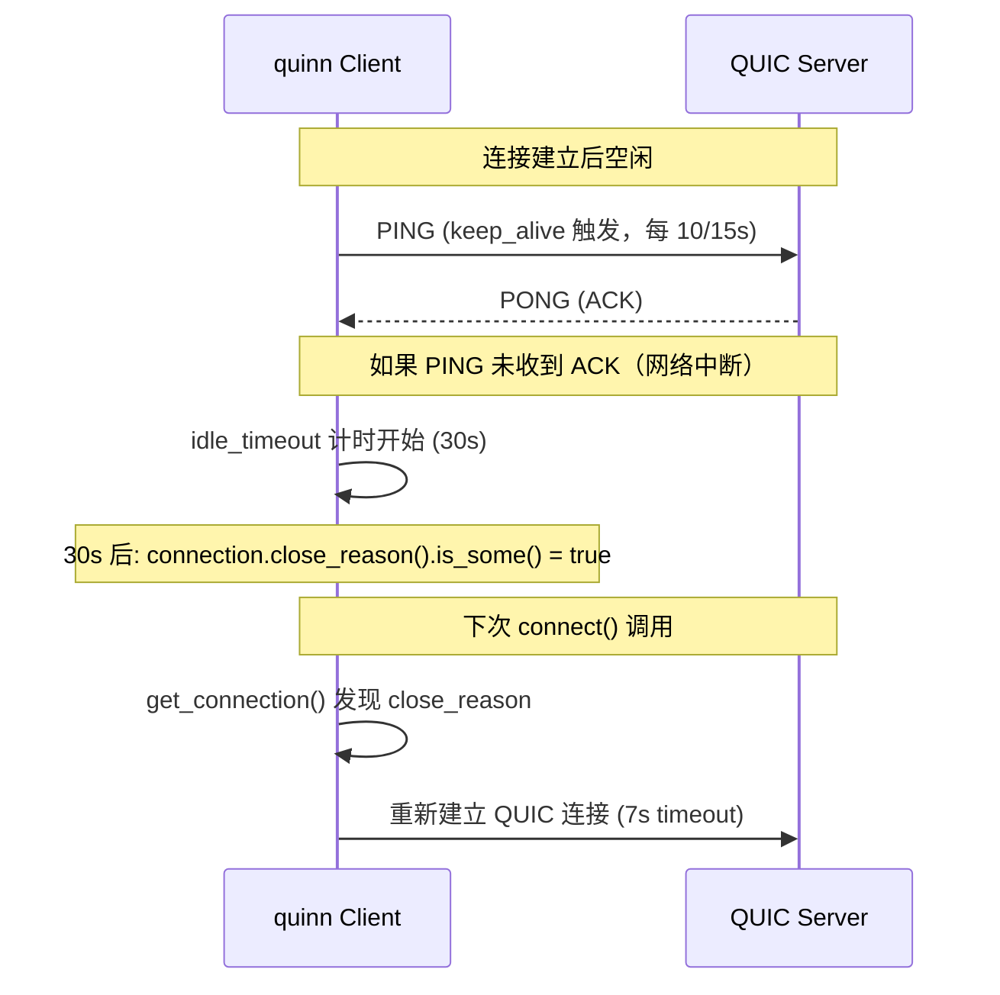
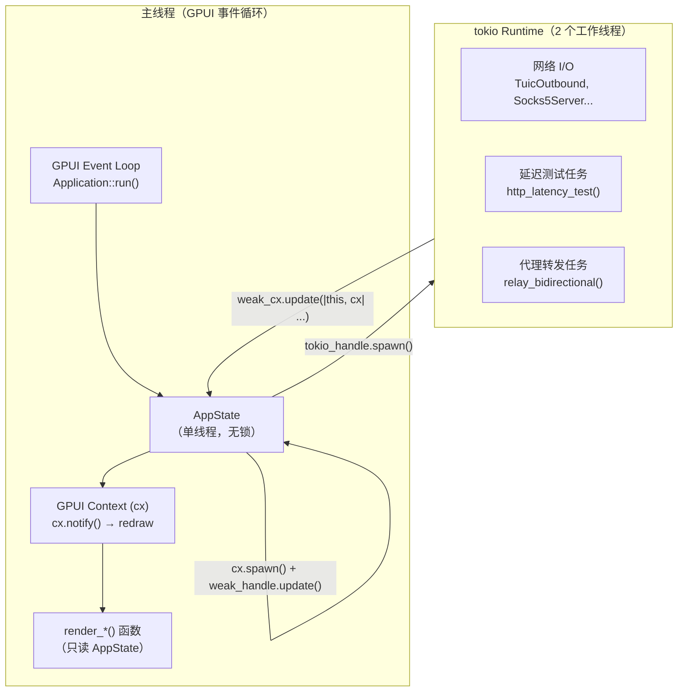

# XTune 深度技术分析（补充篇）

> 本文是 [internals.mdx](./internals.mdx) 的补充，包含更深层的实现细节分析、实际代码行为与注释/文档之间的偏差、并发模型、安全分析等。基于对源码的逐行阅读。

---

## 目录

1. [路由 cache 的真实策略：全量清除而非 LRU](#1-路由-cache-的真实策略全量清除而非-lru)
2. [DNS cache 的真实策略：真正的 LRU（与旧文档矛盾的纠正）](#2-dns-cache-的真实策略真正的-lru)
3. [Relay 统计计数 Bug：跨 poll 丢失字节](#3-relay-统计计数-bug跨-poll-丢失字节)
4. [speed_test_node 测速目标错误](#4-speed_test_node-测速目标错误)
5. [DNS inflight 去重机制的完整分析](#5-dns-inflight-去重机制的完整分析)
6. [ConnPool 的并发正确性](#6-connpool-的并发正确性)
7. [QUIC 传输参数与 Idle Timeout 含义](#7-quic-传输参数与-idle-timeout-含义)
8. [并发模型：GPUI 主线程 vs tokio 工作线程](#8-并发模型gpui-主线程-vs-tokio-工作线程)
9. [安全分析](#9-安全分析)
10. [RetryOutbound 退避计算的精确行为](#10-retryoutbound-退避计算的精确行为)
11. [relay_bidirectional 的 Future 实现细节](#11-relay_bidirectional-的-future-实现细节)
12. [路由规则匹配的边界情况](#12-路由规则匹配的边界情况)
13. [订阅获取的超时风险](#13-订阅获取的超时风险)
14. [测试覆盖分析](#14-测试覆盖分析)

---

## 1. 路由 cache 的真实策略：全量清除而非 LRU

**位置**：`crates/xtune-core/src/router/engine.rs` 第 158-162 行

**注释声称**：`LRU-ish cache`

**实际代码**：

```rust
if let Ok(mut cache) = self.cache.write() {
    if cache.len() >= ROUTE_CACHE_CAP {  // ROUTE_CACHE_CAP = 4096
        cache.clear();  // ← 全量清除！不是 LRU 驱逐一个条目
    }
    cache.insert(host.to_string(), action.clone());
}
```

### 行为分析

| 策略 | 当 cache 满时 | 命中率影响 |
|------|-------------|----------|
| LRU（理想） | 驱逐最久未用的 1 条 | 下次命中率 ≈ 4095/4096 |
| 当前实现（全量清除） | 清空所有 4096 条 | 下次命中率 ≈ 0 |

**惊群效应**：一旦 cache 达到 4096 条（对于域名多样的代理节点，这可能在数小时内发生），触发全量 clear。紧接着的几百个请求全部 cache miss，每个都需要线性遍历规则列表，并触发写锁（多个线程同时 miss → 多个线程同时写入 cache，造成写锁争用）。

### 修复方案

```rust
// 在 router/engine.rs 中
use lru::LruCache;
use std::num::NonZeroUsize;

struct Router {
    cache: RwLock<LruCache<String, RouteAction>>,
    // ...
}

// 初始化
cache: RwLock::new(LruCache::new(NonZeroUsize::new(4096).unwrap())),

// 使用（LruCache::get 更新 LRU 顺序，put 自动驱逐）
if let Ok(mut cache) = self.cache.write() {
    cache.put(host.to_string(), action.clone());
}
if let Ok(mut cache) = self.cache.read() {
    if let Some(action) = cache.peek(host) {  // peek 不更新 LRU 顺序，避免写锁
        return action.clone();
    }
}
```

---

## 2. DNS cache 的真实策略：真正的 LRU

**位置**：`crates/xtune-core/src/dns/mod.rs` 第 204-217 行

**注意**：前文（optimize-roadmap.mdx）将 DNS cache 与 router cache 同等对待，称其"缺少 LRU 驱逐"。这是**错误的**。DNS cache 的实际实现：

```rust
// 先过期清除
cache.retain(|_, e| e.expires_at > now);

// 如果过期清除后仍超过上限，做真正的 LRU 驱逐
if cache.len() >= DNS_CACHE_MAX_ENTRIES {  // 1024
    if let Some(lru_key) = cache
        .iter()
        .min_by_key(|(_, e)| e.last_used)  // ← 真正的 LRU 选择
        .map(|(k, _)| k.clone())
    {
        cache.remove(&lru_key);
    }
}
```

**结论**：DNS cache 实现是正确的 LRU 语义（驱逐 `last_used` 最小的条目），无需修改。

**`last_used` 更新时机**（第 122-127 行）：

```rust
if let Some(entry) = cache.get_mut(domain) {
    entry.last_used = now;  // ← cache hit 时更新
    if entry.expires_at > now {
        return Ok(entry.addresses.clone());
    }
    // stale 但未超过 5min：仍更新 last_used，触发后台刷新
}
```

**stale-while-revalidate 正确性**：后台刷新时创建了一个临时的 `DnsResolver` 实例（用 `inflight: Mutex::new(HashMap::new())`），这意味着后台刷新不会与主实例的 inflight 去重共享状态。如果主实例有相同域名的查询正在进行，后台刷新会重复查询，造成两个并发 DNS 请求。低风险（DNS 服务器幂等），但有优化空间。

---

## 3. Relay 统计计数 Bug：跨 poll 丢失字节

**位置**：`crates/xtune-core/src/proxy/relay.rs`

### 问题根源

`relay_bidirectional` 实现为一个自定义 `Future`（`Relay` struct）。每次 tokio 调用 `poll()` 时，调用 `transfer_one()`。`transfer_one` 内部有一个局部 `transferred: u64 = 0` 变量：

```rust
fn transfer_one<R, W>(...) -> Poll<io::Result<u64>> {
    let mut transferred: u64 = 0;  // ← 每次调用重置

    loop {
        if buf.pos < buf.cap {
            let n = ready!(poll_write(...))?;  // 如果返回 Pending → 立即返回
            buf.pos += n;
            transferred += n as u64;  // 已写字节
            continue;
        }
        // ...
        match ready!(poll_read(...)) {  // 如果返回 Pending → 立即返回
            // ...
        }
    }
}
```

`ready!` 宏在内部 future Pending 时，直接 `return Poll::Pending`，此时局部 `transferred` 被丢弃。

**统计累积代码**（`Relay::poll` 方法）：

```rust
match a_to_b {
    Poll::Ready(Ok(n)) => this.a_to_b += n,  // ← 仅在 Ready 时累积
    Poll::Ready(Err(e)) => return Poll::Ready(Err(e)),
    Poll::Pending => {}  // ← 这次 poll 传输的字节被忽略
}
```

### 结论

**实际表现**：`ProxyStats.bytes_sent` 和 `bytes_received` 几乎永远为 0 或非常小（仅最后一次 `poll_flush` 的字节数）。GUI 中的流量显示（↑ / ↓）是不准确的。

**不影响**：代理转发的正确性（CopyBuf 状态通过 struct 字段跨 poll 保留，实际字节都被正确转发了，只是统计出错）。

### 修复方案

在 `Relay` struct 中增加中间计数器，在每次 poll 时累积：

```rust
struct Relay<'a, A: ?Sized, B: ?Sized> {
    // ... 现有字段
    a_to_b_pending: u64,  // 跨 poll 的 a→b 已传输字节
    b_to_a_pending: u64,  // 跨 poll 的 b→a 已传输字节
}

// 在 Relay::poll 中：
let a_to_b = transfer_one(cx, this.a, this.b, &mut this.a_buf, &mut this.a_done);
let b_to_a = transfer_one(cx, this.b, this.a, &mut this.b_buf, &mut this.b_done);

// transfer_one 需要同时返回 "本次 poll 已传输字节" 即使 Pending
// 或者：改为在每次写入成功后通过回调累积
```

更简洁的修复：修改 `transfer_one` 签名，通过 `&mut u64` 参数累积，而非返回：

```rust
fn transfer_one<R, W>(
    cx: &mut Context<'_>,
    reader: &mut R,
    writer: &mut W,
    buf: &mut CopyBuf,
    done: &mut bool,
    total_transferred: &mut u64,  // ← 新增，跨 poll 累积
) -> Poll<io::Result<()>> {  // 返回值不再包含字节数
    loop {
        if buf.pos < buf.cap {
            let n = ready!(Pin::new(&mut *writer).poll_write(cx, &buf.buf[buf.pos..buf.cap]))?;
            buf.pos += n;
            *total_transferred += n as u64;  // ← 每次 write 立即累积
            ...
        }
        ...
    }
}
```

---

## 4. speed_test_node 测速目标错误

**位置**：`crates/xtune-core/src/proxy/speedtest.rs` 第 20-66 行

**问题**：

```rust
let request =
    b"GET /generate_204 HTTP/1.1\r\nHost: www.gstatic.com\r\nConnection: close\r\n\r\n";
stream.write_all(request).await?;

// 读取并统计字节数
loop {
    match stream.read(&mut buf).await {
        Ok(0) => break,
        Ok(n) => total_bytes += n as u64,
        ...
    }
}
let download_kbps = if total_bytes > 0 && dl_elapsed.as_millis() > 0 {
    Some(((total_bytes as f64 / 1024.0) / dl_elapsed.as_secs_f64()) as u32)
} else {
    None
};
```

`/generate_204` 返回 `HTTP/1.1 204 No Content` 加极少的头部，没有 body。读取的字节数约为 100-200 字节（仅 HTTP 响应头），`download_kbps` 计算结果永远接近 0（约 0-5 KB/s），毫无意义。

**结论**：`speed_test_node()` 的 `download_kbps` 字段永远无效。但这个函数目前未在 GUI 中集成，所以对用户无影响，只是功能预留但不可用。

### 修复方案

将测速目标改为大文件端点：

```rust
// Option 1: Cloudflare speed test endpoint
let request = b"GET /__down?bytes=10485760 HTTP/1.1\r\nHost: speed.cloudflare.com\r\nConnection: close\r\n\r\n";
// 10 MB 响应

// Option 2: 使用 HTTP 分块读取并限时
let dl_timeout = Duration::from_secs(10);
let start = Instant::now();
let mut total = 0u64;
while start.elapsed() < dl_timeout {
    match tokio::time::timeout(..., stream.read(&mut buf)).await {
        Ok(Ok(n)) if n > 0 => total += n as u64,
        _ => break,
    }
}
```

---

## 5. DNS inflight 去重机制的完整分析

**位置**：`dns/mod.rs` 第 153-178 行

### 去重类型

```rust
type InflightEntry = Arc<tokio::sync::OnceCell<Result<Vec<IpAddr>, String>>>;
```

`tokio::sync::OnceCell` 保证 `get_or_init` 的初始化 Future 只运行一次（即使多个 caller 并发调用）。多个 caller 共享同一个 Arc，只有第一个 caller 实际运行 DNS 查询，其余等待。

### 生命周期

```
caller A: 创建 OnceCell → 运行 resolve_uncached → 写入结果 → cleanup (remove inflight)
caller B: 找到已有 OnceCell → 等待 A 的结果 → 得到相同结果 → cleanup (remove 已不存在，no-op)
caller C (A 已完成后): 找不到 inflight 条目 → 创建新 OnceCell → 运行新查询
```

### 边界情况：所有 caller 都被 drop

```
caller A: 创建 OnceCell → 开始 resolve_uncached
caller B: 找到 OnceCell → 等待

时刻 T: A 和 B 的 tokio task 都被 cancel（如 timeout）
→ Arc<OnceCell> 的引用计数: inflight HashMap 持有 1 个，A 和 B 的局部 cell 各持有 1 个
→ 当 A 和 B drop 后，Arc 引用计数降为 1（HashMap 仍持有）
→ inflight 条目永久存活

下次 caller C 查询同一域名:
→ 找到 inflight 中的旧 Arc<OnceCell>
→ 调用 get_or_init: 如果 OnceCell 已初始化（A 在 drop 前完成了），返回旧结果
→ 调用 get_or_init: 如果 OnceCell 未初始化（A 在 drop 前未完成），重新运行查询
```

**结论**：
1. 如果 A 在被 cancel 前完成了查询，旧 OnceCell 中有结果，C 得到正确的（可能稍旧的）结果
2. 如果 A 在被 cancel 前没有完成，OnceCell 未初始化，C 重新查询。正确。
3. **内存泄漏风险**：如果所有 caller 都被 cancel 且 A 没有完成查询，inflight 中的 Arc<OnceCell> 永久存活（cleanup 在 get_or_init 之后，从未执行）。对于常见代理使用场景，此风险极低（域名集合有限，DNS 查询通常 < 5s）。

### 实际影响评估

低风险。典型代理场景：
- 域名集合有限（用户访问的域名重复性高）
- DNS 查询响应时间 1-5s，极少超过 timeout
- 即使有泄漏，泄漏的条目（Arc<OnceCell>）比 HashMap<String, IpAddr> 小

---

## 6. ConnPool 的并发正确性

**位置**：`pool.rs` 第 99-152 行

通过代码审查确认 ConnPool 没有 BUG-3（pool.fill() 超额填充）：

### schedule_fill 的原子锁

```rust
fn schedule_fill(&self) {
    if !self.inner.filling.swap(true, Ordering::Relaxed) {
        // 只有一个 task 能通过 swap 进入这里
        tokio::spawn(async move { p.fill().await; p.inner.filling.store(false, ...); });
    }
}
```

`filling` 原子变量确保同一时刻只有一个 fill() 在运行。两个并发的 schedule_fill() 调用：
- 先到的：`swap(true)` 返回 false → 进入 if，spawn fill 任务
- 后到的：`swap(true)` 返回 true → 不进入 if，直接返回

### fill() 内的正确性

```rust
loop {
    let needs_more = {
        let q = self.inner.conns.lock().await;
        q.len() < self.inner.capacity  // ← 在锁内检查
    };
    if !needs_more { break; }

    match self.inner.factory.create().await {  // ← 锁外创建（允许并发）
        Ok(stream) => {
            let mut q = self.inner.conns.lock().await;
            if q.len() < self.inner.capacity {  // ← 二次检查（防止 get() 竞争）
                q.push_back(...);
            }
            // 如果二次检查失败（get() 已取走连接），连接被丢弃（stream drop 自动关闭）
        }
        ...
    }
}
```

由于 `schedule_fill` 的 `filling` 保证只有一个 fill() 并发，loop 内的"check-create-insert"虽然不是原子的，但唯一的并发来源是 `get()` 调用取走连接（减少 pool 大小）。二次检查 `if q.len() < self.inner.capacity` 防止了超额填充。**结论**：ConnPool 实现是并发安全的，BUG-3 不存在。

---

## 7. QUIC 传输参数与 Idle Timeout 含义

### TUIC 传输配置

```rust
// tuic.rs - create_connection()
transport.keep_alive_interval(Some(Duration::from_secs(10)));
transport.max_idle_timeout(Some(IdleTimeout::try_from(Duration::from_secs(30)).unwrap()));
```

### Hysteria2 传输配置

```rust
// hysteria2.rs - create_connection()
transport.keep_alive_interval(Some(Duration::from_secs(15)));
transport.max_idle_timeout(Some(IdleTimeout::try_from(Duration::from_secs(30)).unwrap()));
```

### Idle Timeout 交互

QUIC idle timeout 的关键点（quinn 实现）：



**关键洞察**：keep_alive_interval 必须 < max_idle_timeout / 2，否则 keep_alive 来不及防止 idle timeout。当前配置：
- TUIC: 10s < 30s / 2 = 15s ✅
- Hysteria2: 15s = 30s / 2 = 15s ⚠️（边界情况，单次 PING 丢包就可能超时）

**建议**：Hysteria2 的 `keep_alive_interval` 降为 10s（与 TUIC 一致）。

---

## 8. 并发模型：GPUI 主线程 vs tokio 工作线程



### 关键约束

1. **AppState 只在主线程修改**：所有 `AppState` 字段变更通过 `cx.update()` 或 GPUI action handler 执行，运行在 GPUI 主线程
2. **tokio 任务获取结果后 post 回主线程**：通过 `weak_handle.update(cx, |this, cx| { this.xxx = result; cx.notify(); })`
3. **无数据竞争**：AppState 无需加锁，即使 100 个并发测试任务，状态更新都序列化到主线程
4. **线程模型与 UI 框架一致**：GPUI（类似 macOS AppKit / WinUI）要求 UI 操作在主线程，xtune 正确遵守

### 2 个工作线程的影响

```rust
// main.rs
tokio::runtime::Builder::new_multi_thread()
    .worker_threads(2)
    .enable_all()
    .build()
```

- **proxy relay**：每个连接一个 relay future，relay 几乎 100% 时间在 I/O wait，不占 CPU。2 个线程可支持数百个并发连接
- **延迟测试**：5 个并发测试（semaphore 限制），每个测试 I/O wait 为主。2 个线程够用
- **CPU 密集操作**（VMess AEAD 加解密）：如果单 VMess 连接传输大文件，加解密可能占用线程。2 个线程下，其他操作可能有延迟
- **建议**：保持 2 个线程（足够日常使用），如需高吞吐场景可提供配置项

---

## 9. 安全分析

### 9.1 本地代理无认证

```rust
// socks5.rs - 握手：只接受 NO AUTH
method == 0x00  // 无认证
```

**风险**：如果用户将 `listen_addr` 改为 `0.0.0.0`，局域网内所有设备均可通过该代理访问互联网（包括付费代理流量）。

**缓解**：默认 `listen_addr = "127.0.0.1"`，仅本机可访问。但用户误操作风险存在。

**建议**：在 GUI 中，当用户将 listen_addr 改为非 127.0.0.1 时，弹出警告："您将允许局域网设备使用此代理"。

### 9.2 skip_cert_verify 的 MITM 风险

```rust
// tuic.rs / hysteria2.rs
if skip_cert_verify {
    // 使用 InsecureTuicVerifier / InsecureHy2Verifier
    // 接受任何 TLS 证书，不验证主机名
}
```

**风险**：中间人（MITM）可以插入假证书，完全解密流量。这是功能性需求（某些自建服务器用自签名证书），但用户可能不理解其含义。

**建议**：在 GUI 中，skip_cert_verify 开启时显示醒目警告（如红色感叹号）。

### 9.3 凭据以明文存储

```yaml
# config.yaml
protocol:
  type: "tuic"
  uuid: "d685aef3-b3c4-4932-9a9d-d0c2f6727dfa"
  password: "supersecret"  # ← 明文
```

**风险**：本地 config.yaml 的读取权限等于密码权限。

**评估**：对于桌面代理客户端，这是业界标准做法（Clash、V2Ray 等均相同）。低风险，无需改变。

### 9.4 DNS 查询泄漏风险

**当前行为**：DNS 解析通过 `tokio::net::lookup_host()` 执行（使用系统 DNS，走系统网络栈，**不经过代理**）。

**场景**：用户在代理下访问 `sensitive-site.example.com`：
1. `lookup_host("sensitive-site.example.com")` → 使用系统 DNS（可能是 ISP DNS）→ **泄漏域名**
2. TCP 连接通过代理 → 内容加密，不泄漏

**现状**：DNS 仅在 `tuic.rs` / `hysteria2.rs` 的 `resolve_server_addrs()` 中用于解析**代理服务器**地址（不是目标地址）。目标域名直接传给代理服务器，在代理服务器端 DNS 解析。

**结论**：目标域名 DNS 不在本地解析，不存在泄漏。代理服务器地址 DNS 用系统解析，会暴露代理服务器域名（但这本身就是已知的）。安全性可接受。

### 9.5 QUIC 0-RTT 重放攻击

QUIC 支持 0-RTT 快速重连，但 0-RTT 数据存在重放风险。当前 quinn 配置：

```rust
// tuic.rs - 未明确配置 0-RTT
// quinn 默认: 0-RTT 禁用（客户端默认不缓存 session ticket）
```

**评估**：quinn 默认客户端行为是禁用 0-RTT，每次连接都是完整的 1-RTT 握手。低风险。

---

## 10. RetryOutbound 退避计算的精确行为

**位置**：`connector.rs` 第 91-133 行

```rust
let mut delay_ms = self.base_delay_ms;  // 初始 200ms
for attempt in 0..self.max_attempts {  // 0, 1, 2
    match self.inner.connect(&host, port).await {
        Ok(stream) => return Ok(stream),
        Err(e) => {
            last_err = Some(e);
            if attempt + 1 < self.max_attempts {
                tokio::time::sleep(Duration::from_millis(delay_ms)).await;
                delay_ms = (delay_ms * 2).min(self.max_delay_ms);  // 200 → 400 → (不执行)
            }
        }
    }
}
```

**精确时序**：

| attempt | 失败后等待 | 下次 delay_ms |
|---------|----------|-------------|
| 0（第1次） | 200ms | 400ms |
| 1（第2次） | 400ms | 800ms（但不会用到） |
| 2（第3次） | 不等待（最后一次） | - |

**总最坏情况**（3 次全失败）：各协议超时 + 200ms + 400ms 等待
- VMess/VLESS/Trojan（直连 10s timeout）：30s × 3 = 90s + 600ms ≈ **91s**
- Shadowsocks：同上

这个总超时时间较长，但只在连接完全失败时发生。

---

## 11. relay_bidirectional 的 Future 实现细节

**位置**：`relay.rs` 第 119-164 行

### 关键设计：两方向不独立

```rust
fn poll(mut self: Pin<&mut Self>, cx: &mut Context<'_>) -> Poll<Self::Output> {
    let this = &mut *self;

    let a_to_b = if !this.a_done || this.a_buf.pos < this.a_buf.cap {
        transfer_one(cx, this.a, this.b, ...)
    } else {
        Poll::Ready(Ok(0))
    };

    let b_to_a = if !this.b_done || this.b_buf.pos < this.b_buf.cap {
        transfer_one(cx, this.b, this.a, ...)
    } else {
        Poll::Ready(Ok(0))
    };

    // 两个方向都有 Ready(Err) → 立即返回错误
    // 两个方向都 done → 返回成功
    // 否则 → Pending（等待 waker 触发）
}
```

**与 tokio::io::copy_bidirectional 的区别**：
- tokio 内置：使用两个独立 future，调度器分开 poll
- xtune 实现：单个 future，每次 poll 驱动两个方向，减少调度开销

**优点**：两个方向共用一次唤醒，当任一方向有数据时，两个方向都被检查，减少"只唤醒了一个方向"的情况。

**潜在问题**：如果 A→B 方向有大量数据需要写（buf 满），`transfer_one` 可能连续返回（写入 + 继续循环），占用较长 CPU 时间而不让 B→A 方向有机会处理。这是 relay 实现的固有权衡。

---

## 12. 路由规则匹配的边界情况

### DomainSuffix 匹配逻辑

```rust
MatchRule::DomainSuffix(suffix) => {
    host_lower.ends_with(suffix.as_str())  // 含后缀匹配（如 ".google.com"）
    || host_lower == suffix.trim_start_matches('.')  // 精确域名匹配
}
```

**边界情况**：
- `suffix = ".cn"`，`host = "baidu.cn"` → `ends_with(".cn")` = true ✅
- `suffix = ".cn"`，`host = "cn"` → `ends_with(".cn")` = false，`== "cn"` = true ✅
- `suffix = ".cn"`，`host = "notcn"` → `ends_with(".cn")` = false，`== "cn"` = false ✅
- `suffix = "google.com"`（无点前缀），代码在 `from_config` 中自动加点：`".google.com"` ✅

**潜在误匹配**：
- `suffix = ".abc"，host = "notabc"` → `ends_with(".abc")` = false ✅
- `suffix = ".abc"，host = "habc"` → `ends_with(".abc")` = false ✅（字节边界正确）

### IpCidr 匹配边界

```rust
let mask = u32::MAX.checked_shl(32 - prefix_len as u32).unwrap_or(0);
```

当 `prefix_len = 0`（匹配所有 IP）：`32 - 0 = 32`，`checked_shl(32)` 溢出 → `unwrap_or(0)` → `mask = 0` → `ip_bits & 0 == net_bits & 0` → `0 == 0` 恒真 ✅

当 `prefix_len = 32`（精确匹配）：`32 - 32 = 0`，`checked_shl(0)` = `u32::MAX` → 完整掩码 ✅

**无 Bug**：边界情况处理正确。

---

## 13. 订阅获取的超时风险

**位置**：`crates/xtune-core/src/config/subscription.rs`

从 exploration 报告得知，订阅获取使用 `reqwest` 客户端，但需要确认超时配置。GUI/CLI 在启动时调用订阅获取，若无超时，可能阻塞启动流程。

```rust
// 需验证：subscription.rs 中的 reqwest Client 是否设置了超时
let client = reqwest::Client::builder()
    .timeout(Duration::from_secs(30))  // 是否有？
    .build()?;
```

**建议**：确保订阅获取有明确超时（建议 30s），并在超时时使用缓存的旧节点列表，而非阻塞启动或失败退出。

---

## 14. 测试覆盖分析

### 现有测试（118 个）

| 模块 | 测试类型 | 覆盖内容 |
|------|---------|---------|
| `connector.rs` | 单元测试 | DirectOutbound echo 测试 |
| `router/engine.rs` | 单元测试 | 各 MatchRule 类型、边界情况、CIDR 计算 |
| `relay.rs` | 单元测试 | buf_size 常量验证；relay 流程（简化） |
| `socks5.rs` | 集成测试 | SOCKS5 握手 + CONNECT |
| `http.rs` | 集成测试 | HTTP CONNECT 隧道 |
| `proxy/service.rs` | 集成测试 | ProxyService 完整流程 |
| `speedtest.rs` | 集成测试 | DirectOutbound 延迟测试（需网络） |
| `tuic.rs` | 单元测试 | TuicOutbound::new 配置解析 |
| `hysteria2.rs` | 单元测试 | Hysteria2Outbound::new 配置解析 |
| `dns/mod.rs` | 单元测试 | cache 命中/过期，域名分组匹配 |
| `tun.rs` | 单元测试 | 环境检测，命令查找 |

### 明显的测试盲区

| 盲区 | 风险 |
|------|------|
| VMess/VLESS/Trojan/SS connect() 流程 | 协议帧格式错误难以发现 |
| RetryOutbound 退避计时 | 可能退避过长或过短 |
| ConnPool 并发 get() 压力测试 | 竞态条件难以检测 |
| Router cache 满时行为（全量清除） | 清除后命中率骤降，无测试 |
| relay 统计计数正确性 | 统计 Bug 无测试发现 |
| verify_local_http_proxy 超时分配 | 假设各 phase 速度，无测试验证 |
| TUIC/Hysteria2 open_bi 重试逻辑 | stale 连接 retry 无集成测试 |
| 多地址解析（resolve_server_addrs 排序） | 可用单元测试验证 |

### 建议优先添加的测试

```rust
// 1. Router cache 满时行为
#[test]
fn test_router_cache_full_flush() {
    let router = Router::new(rules);
    // 插入 4096 + 1 个不同域名
    for i in 0..=4096 {
        router.route(&format!("host{}.example.com", i), 80);
    }
    // 验证 4097 个域名后 cache 大小（应该是 1，flush 后只有最新的）
    // 验证之前缓存的域名现在 cache miss
}

// 2. Relay 统计计数
#[tokio::test]
async fn test_relay_stats_accuracy() {
    let data = vec![0u8; 1024 * 1024];  // 1MB
    // relay 数据，验证返回的 (bytes_a_to_b, bytes_b_to_a) 等于实际传输量
}

// 3. ConnPool 并发压力
#[tokio::test]
async fn test_pool_concurrent_get() {
    // 100 个并发 get()，验证 pool 不超额填充，不出现 panic
}
```

---

*本文分析基于对源码的逐行阅读，优先于注释和文档*

*对应 commit: `4e8b8cf`*
