# XTune 内部实现详解（开发者文档）

> 面向开发者的深度技术文档。覆盖协议实现细节、数据流、模块交互与关键设计决策。

---

## 目录

1. [Workspace 结构与 Crate 职责](#1-workspace-结构与-crate-职责)
2. [核心抽象：Outbound Trait](#2-核心抽象outbound-trait)
3. [工厂模式：create_outbound](#3-工厂模式create_outbound)
4. [连接生命周期：TCP 协议 vs QUIC 协议](#4-连接生命周期tcp-协议-vs-quic-协议)
5. [TUIC v5 协议实现](#5-tuic-v5-协议实现)
6. [Hysteria2 协议实现](#6-hysteria2-协议实现)
7. [TCP 协议实现（VMess / VLESS / Trojan / SS）](#7-tcp-协议实现vmess--vless--trojan--ss)
8. [传输层：TLS 指纹伪装（craftls）](#8-传输层tls-指纹伪装craftls)
9. [连接池设计（ConnPool）](#9-连接池设计connpool)
10. [双向中继实现（relay_bidirectional）](#10-双向中继实现relay_bidirectional)
11. [本地代理服务：SOCKS5 + HTTP](#11-本地代理服务socks5--http)
12. [路由引擎（Router / RuleSet）](#12-路由引擎router--ruleset)
13. [DNS 解析器（DnsResolver）](#13-dns-解析器dnsresolver)
14. [代理服务编排（ProxyService）](#14-代理服务编排proxyservice)
15. [GUI 状态机（AppState）](#15-gui-状态机appstate)
16. [延迟测试流水线](#16-延迟测试流水线)
17. [连通性验证流程](#17-连通性验证流程)
18. [统计采集（ProxyStats）](#18-统计采集proxystats)
19. [完整连接数据流（TUIC 示例）](#19-完整连接数据流tuic-示例)
20. [TUN 模式](#20-tun-模式)
21. [并发模型：GPUI + tokio](#21-并发模型gpui--tokio)
22. [订阅管理流程](#22-订阅管理流程)
23. [RetryOutbound 退避时序](#23-retryoutbound-退避时序)

---

## 1. Workspace 结构与 Crate 职责

```
xtune/
├── Cargo.toml              # workspace root（edition 2024）
├── crates/
│   ├── xtune-core/         # 核心协议库（lib）
│   ├── xtune-gui/          # 桌面 GUI（bin: xtune）
│   ├── xtune-cli/          # 命令行工具（bin: xtune-cli）
│   └── craftls/            # 定制 rustls 分支（TLS 指纹）
├── config.yaml             # 运行时配置
└── docs/                   # 文档
```

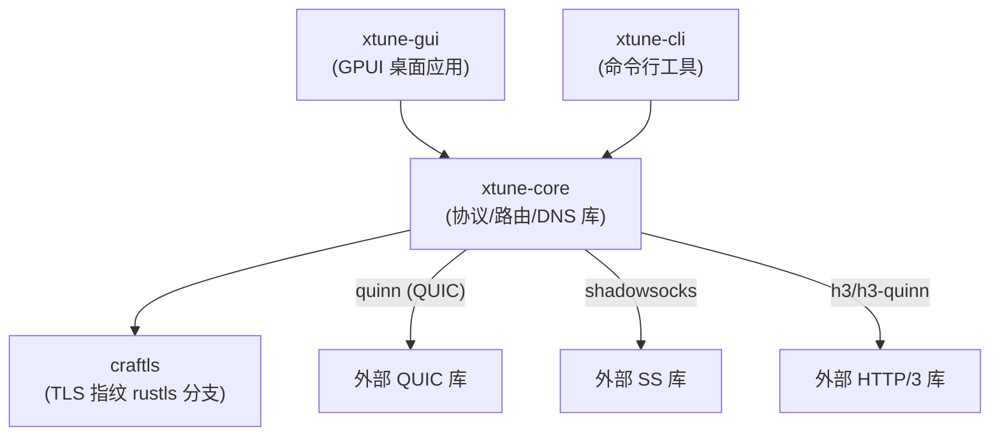
```mermaid
graph TD
    GUI["xtune-gui<br/>(GPUI 桌面应用)"]
    CLI["xtune-cli<br/>(命令行工具)"]
    CORE["xtune-core<br/>(协议/路由/DNS 库)"]
    CRAFTLS["craftls<br/>(TLS 指纹 rustls 分支)"]

    GUI --> CORE
    CLI --> CORE
    CORE --> CRAFTLS
    CORE --> |"quinn (QUIC)"| EXT1["外部 QUIC 库"]
    CORE --> |"shadowsocks"| EXT2["外部 SS 库"]
    CORE --> |"h3/h3-quinn"| EXT3["外部 HTTP/3 库"]
```

### 依赖关键点

| 依赖 | 版本 | 用途 | 注意 |
|------|------|------|------|
| `gpui` | 0.2.2 | GUI 框架（Zed 编辑器） | 仅 Windows/macOS/Linux GPU |
| `quinn` | 0.11 | QUIC 传输（TUIC/Hy2） | UDP，NAT 穿透敏感 |
| `craftls` | patch | TLS ClientHello 指纹 | patched via `[patch.crates-io]` |
| `craft-tls` | 0.25 | craftls 对应的 tokio-rustls | 与标准 rustls 0.23 并存 |
| `shadowsocks` | 1.x | Shadowsocks AEAD | `aead-cipher-2022` feature |
| `h3` / `h3-quinn` | 0.0.8/10 | Hysteria2 HTTP/3 握手 | 实验性 API |
| `tun` | 0.8 | TUN 设备（需管理员权限） | Windows 需 WinTun.dll |
| `ipstack` | 1.0.0 | TUN 数据包解析 | 仅 TUN 模式 |

---

## 2. 核心抽象：Outbound Trait

所有代理协议实现同一个 trait，使上层代码与协议实现完全解耦：

```rust
// crates/xtune-core/src/proxy/connector.rs
pub trait Outbound: Send + Sync + 'static {
    fn connect(
        &self,
        host: &str,
        port: u16,
    ) -> Pin<Box<dyn Future<Output = Result<BoxProxyStream>> + Send + '_>>;

    fn name(&self) -> &str;
}

pub type BoxProxyStream = Box<dyn AsyncRead + AsyncWrite + Unpin + Send>;
pub type SharedOutbound = Arc<dyn Outbound>;
```

### 实现层次结构

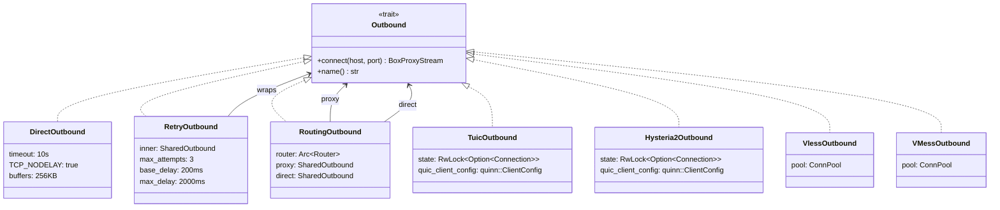
```mermaid
classDiagram
    class Outbound {
        <<trait>>
        +connect(host, port) BoxProxyStream
        +name() str
    }

    class DirectOutbound {
        timeout: 10s
        TCP_NODELAY: true
        buffers: 256KB
    }

    class RetryOutbound {
        inner: SharedOutbound
        max_attempts: 3
        base_delay: 200ms
        max_delay: 2000ms
    }

    class RoutingOutbound {
        router: Arc~Router~
        proxy: SharedOutbound
        direct: SharedOutbound
    }

    class TuicOutbound {
        state: RwLock~Option~Connection~~
        quic_client_config: quinn::ClientConfig
    }

    class Hysteria2Outbound {
        state: RwLock~Option~Connection~~
        quic_client_config: quinn::ClientConfig
    }

    class VlessOutbound {
        pool: ConnPool
    }

    class VMessOutbound {
        pool: ConnPool
    }

    Outbound <|.. DirectOutbound
    Outbound <|.. RetryOutbound
    Outbound <|.. RoutingOutbound
    Outbound <|.. TuicOutbound
    Outbound <|.. Hysteria2Outbound
    Outbound <|.. VlessOutbound
    Outbound <|.. VMessOutbound
    RetryOutbound --> Outbound : wraps
    RoutingOutbound --> Outbound : proxy
    RoutingOutbound --> Outbound : direct
```

### DirectOutbound 套接字调优

```rust
// connector.rs L34-L67
const DIRECT_CONNECT_TIMEOUT: Duration = Duration::from_secs(10);

impl Outbound for DirectOutbound {
    fn connect(&self, host: &str, port: u16) -> ... {
        let stream = TcpStream::connect(addr).await?;
        stream.set_nodelay(true)?;
        socket2::Socket::from(stream)
            .set_send_buffer_size(256 * 1024)?
            .set_recv_buffer_size(256 * 1024)?
            .set_keepalive(Some(Duration::from_secs(30)))?;
    }
}
```

### RetryOutbound 退避策略

```
attempt 1: 立即执行
attempt 2: 等待 200ms
attempt 3: 等待 min(200ms * 2^(attempt-1), 2000ms)
```

仅 TCP 协议使用 RetryOutbound；QUIC 协议在内部管理重连。

---

## 3. 工厂模式：create_outbound

```rust
// crates/xtune-core/src/proxy/factory.rs
pub fn create_outbound(node: &Node) -> Result<SharedOutbound> {
    match &node.protocol {
        // TCP-based：外层 RetryOutbound(3次)
        ProxyProtocol::VLess { .. }   => return Ok(VlessOutbound::new(node)?.with_retry(3)),
        ProxyProtocol::VMess { .. }   => return Ok(VMessOutbound::new(node)?.with_retry(3)),
        ProxyProtocol::Trojan { .. }  => return Ok(TrojanOutbound::new(node)?.with_retry(3)),
        ProxyProtocol::Shadowsocks { .. } => return Ok(SsOutbound::new(node)?.with_retry(3)),

        // QUIC-based：不包 RetryOutbound（内部自管理重连）
        ProxyProtocol::Tuic { .. }      => return Ok(TuicOutbound::new(node)?),
        ProxyProtocol::Hysteria2 { .. } => return Ok(Hysteria2Outbound::new(node)?),
    }
}
```

### 设计理由

QUIC 协议不使用外层 Retry 的原因：

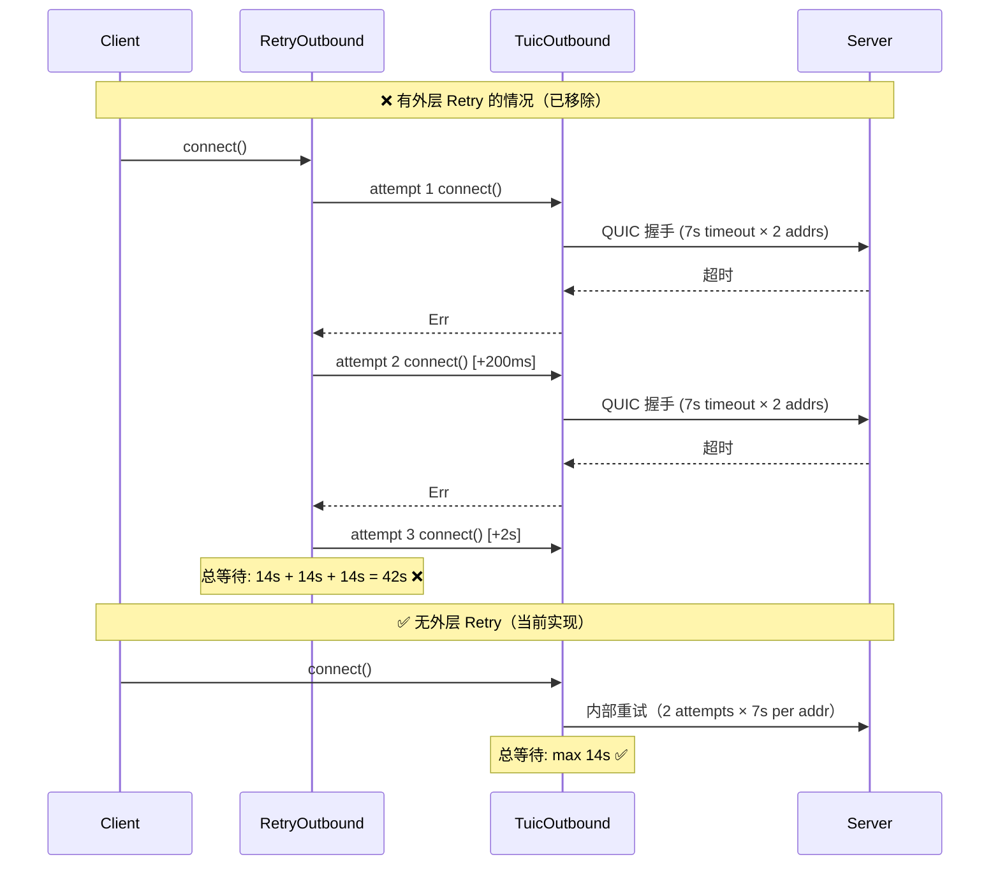
```mermaid
sequenceDiagram
    participant Client
    participant RetryOutbound
    participant TuicOutbound
    participant Server

    Note over Client,Server: ❌ 有外层 Retry 的情况（已移除）
    Client->>RetryOutbound: connect()
    RetryOutbound->>TuicOutbound: attempt 1 connect()
    TuicOutbound->>Server: QUIC 握手 (7s timeout × 2 addrs)
    Server-->>TuicOutbound: 超时
    TuicOutbound-->>RetryOutbound: Err
    RetryOutbound->>TuicOutbound: attempt 2 connect() [+200ms]
    TuicOutbound->>Server: QUIC 握手 (7s timeout × 2 addrs)
    Server-->>TuicOutbound: 超时
    TuicOutbound-->>RetryOutbound: Err
    RetryOutbound->>TuicOutbound: attempt 3 connect() [+2s]
    Note over RetryOutbound: 总等待: 14s + 14s + 14s = 42s ❌

    Note over Client,Server: ✅ 无外层 Retry（当前实现）
    Client->>TuicOutbound: connect()
    TuicOutbound->>Server: 内部重试（2 attempts × 7s per addr）
    Note over TuicOutbound: 总等待: max 14s ✅
```

---

## 4. 连接生命周期：TCP 协议 vs QUIC 协议

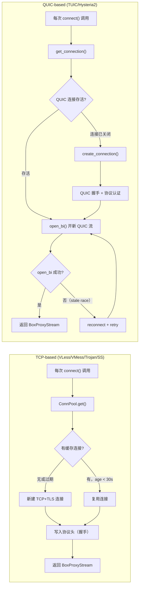
```mermaid
flowchart LR
    subgraph TCP["TCP-based (VLess/VMess/Trojan/SS)"]
        direction TB
        T1["每次 connect() 调用"] --> T2["ConnPool.get()"]
        T2 --> T3{"有缓存连接?"}
        T3 -->|"有，age < 30s"| T4["复用连接"]
        T3 -->|"无或过期"| T5["新建 TCP+TLS 连接"]
        T5 --> T6["写入协议头（握手）"]
        T4 --> T6
        T6 --> T7["返回 BoxProxyStream"]
    end

    subgraph QUIC["QUIC-based (TUIC/Hysteria2)"]
        direction TB
        Q1["每次 connect() 调用"] --> Q2["get_connection()"]
        Q2 --> Q3{"QUIC 连接存活?"}
        Q3 -->|"存活"| Q4["open_bi() 开新 QUIC 流"]
        Q3 -->|"连接已关闭"| Q5["create_connection()"]
        Q5 --> Q6["QUIC 握手 + 协议认证"]
        Q6 --> Q4
        Q4 --> Q7{"open_bi 成功?"}
        Q7 -->|"是"| Q8["返回 BoxProxyStream"]
        Q7 -->|"否（stale race）"| Q9["reconnect + retry"]
        Q9 --> Q4
    end
```

**关键差异**：
- TCP：每个 `connect()` 可能新建 TCP+TLS 连接（约 1-2 RTT 开销）；ConnPool 预建连接缓解此问题
- QUIC：一个 UDP 连接承载所有流；`connect()` 仅需 `open_bi()`（约 0 RTT 开销）；连接关闭后自动重连

---

## 5. TUIC v5 协议实现

文件：`crates/xtune-core/src/proxy/tuic.rs`

### 5.1 结构体设计

```rust
pub struct TuicOutbound {
    server: String,
    port: u16,
    uuid: [u8; 16],
    password: String,
    sni: String,
    congestion: CongestionControl,          // Cubic | NewReno | Bbr
    quic_client_config: quinn::ClientConfig, // 预构建，跨重连复用
    state: tokio::sync::RwLock<           // 双检锁保护的连接状态
        Option<(quinn::Endpoint, quinn::Connection)>
    >,
}
```

**关键设计**：`quic_client_config` 在 `new()` 时一次性构建（包含 TLS 根证书、传输参数），后续所有重连直接 clone，避免重复构建开销。

### 5.2 常量

```rust
const TUIC_CONNECT_TIMEOUT: Duration = Duration::from_secs(7);
const TUIC_CONNECT_ATTEMPTS_PER_ADDR: usize = 2;
const TUIC_CONNECT_RETRY_BACKOFF: Duration = Duration::from_millis(250);
```

### 5.3 连接管理（双检锁）

```rust
async fn get_connection(&self) -> Result<(Endpoint, Connection)> {
    // 快速路径：读锁
    {
        let guard = self.state.read().await;
        if let Some((ep, conn)) = guard.as_ref() {
            if conn.close_reason().is_none() {  // 连接仍存活
                return Ok((ep.clone(), conn.clone()));
            }
        }
    }
    // 慢速路径：写锁 + 双检
    let mut guard = self.state.write().await;
    if let Some((ep, conn)) = guard.as_ref() {
        if conn.close_reason().is_none() {
            return Ok((ep.clone(), conn.clone()));
        }
    }
    // 创建新连接
    let (ep, conn) = self.create_connection().await?;
    self.authenticate(&conn).await?;
    *guard = Some((ep.clone(), conn.clone()));
    Ok((ep, conn))
}
```

### 5.4 多地址重试连接

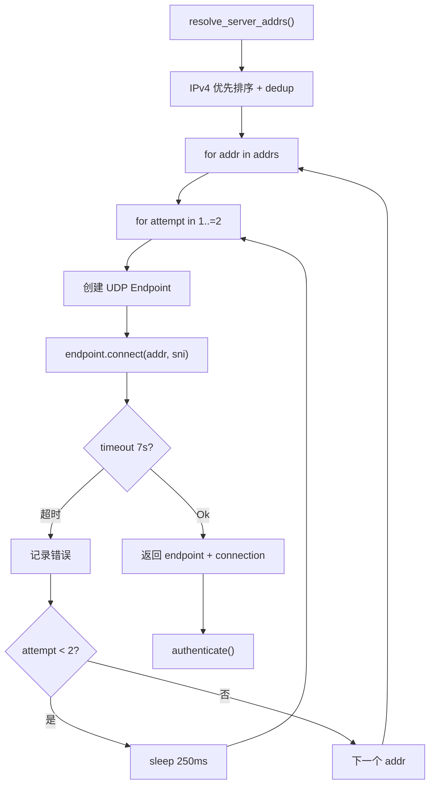
```mermaid
flowchart TD
    A["resolve_server_addrs()"] --> B["IPv4 优先排序 + dedup"]
    B --> C["for addr in addrs"]
    C --> D["for attempt in 1..=2"]
    D --> E["创建 UDP Endpoint"]
    E --> F["endpoint.connect(addr, sni)"]
    F --> G{"timeout 7s?"}
    G -->|"超时"| H["记录错误"]
    G -->|"Ok"| I["返回 endpoint + connection"]
    H --> J{"attempt < 2?"}
    J -->|"是"| K["sleep 250ms"] --> D
    J -->|"否"| L["下一个 addr"]
    L --> C
    I --> M["authenticate()"]
```

### 5.5 TUIC v5 认证流程

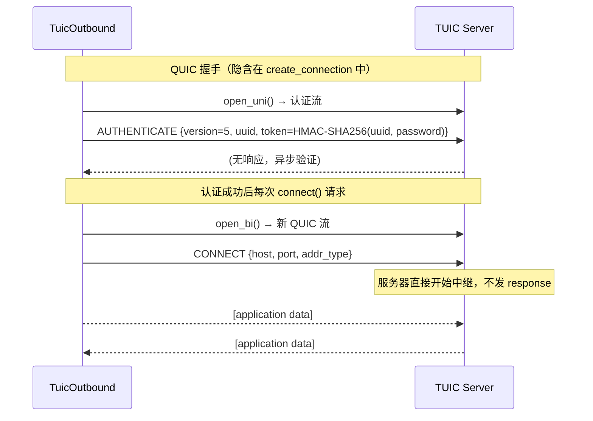
```mermaid
sequenceDiagram
    participant Client as TuicOutbound
    participant Server as TUIC Server

    Note over Client,Server: QUIC 握手（隐含在 create_connection 中）

    Client->>Server: open_uni() → 认证流
    Client->>Server: AUTHENTICATE {version=5, uuid, token=HMAC-SHA256(uuid, password)}
    Server-->>Client: (无响应，异步验证)

    Note over Client,Server: 认证成功后每次 connect() 请求

    Client->>Server: open_bi() → 新 QUIC 流
    Client->>Server: CONNECT {host, port, addr_type}
    Note over Server: 服务器直接开始中继，不发 response
    Client-->>Server: [application data]
    Server-->>Client: [application data]
```

### 5.6 stale 连接竞态修复

```rust
// connect() 中的 open_bi() 重试循环
async fn connect(&self, host: &str, port: u16) -> Result<BoxProxyStream> {
    for attempt in 1..=2 {
        let (_, conn) = self.get_connection().await?;
        match conn.open_bi().await {
            Ok((send, recv)) => {
                // 发送 CONNECT 命令...
                return Ok(Box::new(TuicStream { send, recv }));
            }
            Err(e) => {
                if attempt == 2 { return Err(e.into()); }
                // 连接在 get_connection() 和 open_bi() 之间死亡
                // 下次 get_connection() 会检测 close_reason() 并重连
                tracing::warn!("TUIC open_bi failed (attempt {}): {}", attempt, e);
            }
        }
    }
    unreachable!()
}
```

**竞态窗口**：`get_connection()` 返回一个看起来存活的连接，但在调用 `open_bi()` 之前的毫秒级间隙中，QUIC 连接因 idle timeout 或服务器重启而关闭。`close_reason()` 是在关闭后设置的，所以第一次调用 `get_connection()` 无法检测到。第二次 attempt 触发 `get_connection()` 时，`close_reason().is_some()` 为 true，从而重连。

---

## 6. Hysteria2 协议实现

文件：`crates/xtune-core/src/proxy/hysteria2.rs`

### 6.1 与 TUIC 的主要差异

| 特性 | TUIC v5 | Hysteria2 |
|------|---------|-----------|
| 认证方式 | QUIC + 自定义 AUTHENTICATE 帧 | HTTP/3（h3-quinn）握手 |
| 拥塞控制 | 可配置（Cubic/NewReno/BBR） | 强制 BBR |
| ALPN | `tuic` 或自定义 | `h3` |
| 流控模式 | QUIC 原生 | Hysteria2 自定义 |
| 接收窗口 | 默认 | 16MB（send+recv） |

### 6.2 HTTP/3 认证（authenticate_h3）

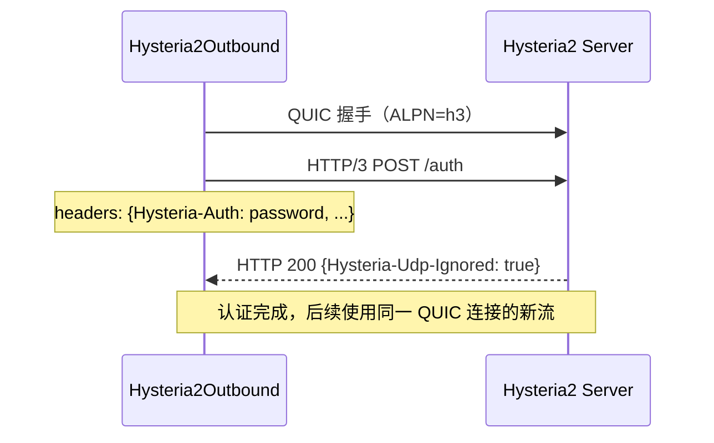
```mermaid
sequenceDiagram
    participant Client as Hysteria2Outbound
    participant Server as Hysteria2 Server

    Client->>Server: QUIC 握手（ALPN=h3）
    Client->>Server: HTTP/3 POST /auth
    Note over Client: headers: {Hysteria-Auth: password, ...}
    Server-->>Client: HTTP 200 {Hysteria-Udp-Ignored: true}
    Note over Client,Server: 认证完成，后续使用同一 QUIC 连接的新流
```

### 6.3 多地址重试（与 TUIC 镜像实现）

```rust
const HY2_CONNECT_TIMEOUT: Duration = Duration::from_secs(7);
const HY2_CONNECT_ATTEMPTS_PER_ADDR: usize = 2;
const HY2_CONNECT_RETRY_BACKOFF: Duration = Duration::from_millis(250);
```

`create_connection()` 逻辑与 TUIC 完全一致：IPv4 优先，每个地址最多 2 次尝试，250ms 退避。

---

## 7. TCP 协议实现（VMess / VLESS / Trojan / SS）

### 7.1 通用连接模式

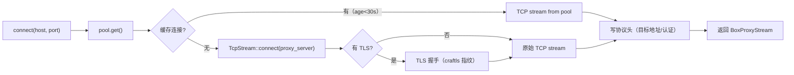
```mermaid
flowchart LR
    A["connect(host, port)"] --> B["pool.get()"]
    B --> C{"缓存连接?"}
    C -->|"有（age<30s）"| D["TCP stream from pool"]
    C -->|"无"| E["TcpStream::connect(proxy_server)"]
    E --> F{"有 TLS?"}
    F -->|"是"| G["TLS 握手（craftls 指纹）"]
    F -->|"否"| H["原始 TCP stream"]
    G --> H
    D --> I["写协议头（目标地址/认证）"]
    H --> I
    I --> J["返回 BoxProxyStream"]
```

### 7.2 ConnPool 与 ConnFactory

```rust
// pool.rs
pub trait ConnFactory: Send + Sync + 'static {
    fn make(&self) -> Pin<Box<dyn Future<Output = Result<BoxProxyStream>> + Send + '_>>;
}

pub struct ConnPool {
    factory: Arc<dyn ConnFactory>,
    capacity: usize,          // 默认 4
    max_age: Duration,        // 默认 30s
    connections: Mutex<VecDeque<(Instant, BoxProxyStream)>>,
}
```

**预热逻辑**：首次 `pool.get()` 调用会在后台触发 `schedule_fill()`，在 50ms 后开始填充连接，避免首次连接延迟与惊群效应。

### 7.3 VMess AEAD 帧格式（简化）

```
客户端 → 服务器:
  [16B IV][16B header][payload chunks...]

  header = AES-128-CFB-encrypt({
    ver=1, IV, key, response_token, options,
    command=TCP, port, addr_type, addr,
    ...
  })

  payload chunks = [{length(2B) + AEAD-tag(16B)}{data}]
```

### 7.4 VLESS 帧格式（简化）

```
客户端 → 服务器:
  [1B ver=0][16B UUID][M addons][1B N][N addon_bytes]
  [1B cmd=TCP][2B port][1B addr_type][addr]
  [payload...]
```

---

## 8. 传输层：TLS 指纹伪装（craftls）

文件：`crates/xtune-core/src/proxy/transport.rs`，`crates/craftls/`

### 8.1 craftls 是什么

标准 rustls 生成的 TLS ClientHello 有固定的 extension 顺序和 cipher suite 列表，深度包检测（DPI）设备可以识别并阻断。`craftls` 是一个 [3andne/craftls](https://github.com/3andne/craftls) 的分支，允许精确控制 ClientHello 指纹以模拟真实浏览器行为。

### 8.2 支持的指纹

| 指纹名 | 模拟目标 | 用途 |
|--------|---------|------|
| `CHROME_112` | Chrome 112（默认） | 最广泛兼容 |
| `CHROME_108` | Chrome 108 | 备选 Chrome |
| `SAFARI_17_1` | Safari 17.1 | iOS/macOS 场景 |
| `FIREFOX_105` | Firefox 105 | 备选 |

### 8.3 使用方式

```rust
// transport.rs
pub fn build_tls_connector(tls_config: &TlsConfig) -> Result<TlsConnector> {
    let fp_name = tls_config.fingerprint.as_deref().unwrap_or("chrome");
    let fp = fingerprint_builder(Some(fp_name))
        .do_not_override_alpn();  // 保留应用层设置的 ALPN

    let rustls_config = RustlsClientConfig::builder()
        .with_root_certificates(get_root_certs())
        .with_no_client_auth()
        .with_fingerprint(fp);

    Ok(TlsConnector::from(Arc::new(rustls_config)))
}
```

### 8.4 双 TLS 栈架构

xtune-core 内**同时存在两套 TLS 实现**，通过 API 版本隔离，互不干扰：

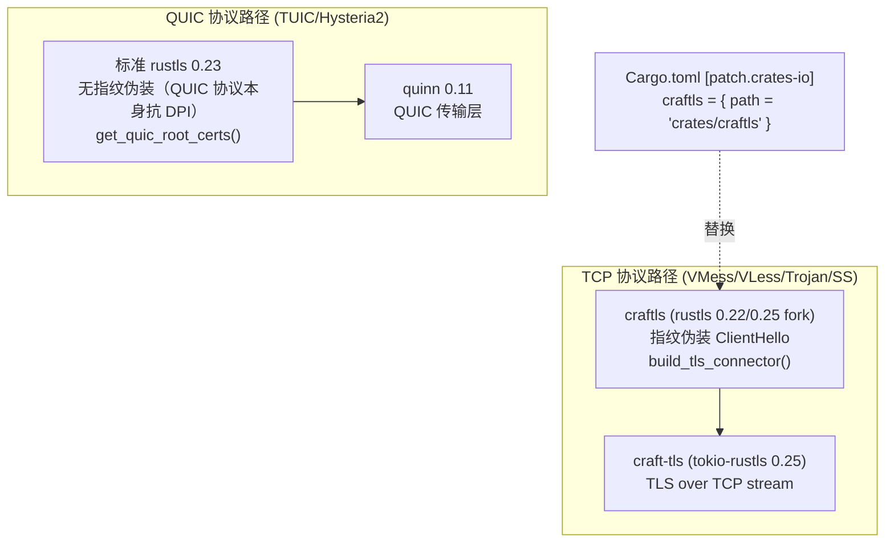
```mermaid
graph TD
    subgraph TCP["TCP 协议路径 (VMess/VLess/Trojan/SS)"]
        craftls["craftls (rustls 0.22/0.25 fork)\n指纹伪装 ClientHello\nbuild_tls_connector()"]
        craft_tokio["craft-tls (tokio-rustls 0.25)\nTLS over TCP stream"]
        craftls --> craft_tokio
    end

    subgraph QUIC["QUIC 协议路径 (TUIC/Hysteria2)"]
        std_rustls["标准 rustls 0.23\n无指纹伪装（QUIC 协议本身抗 DPI）\nget_quic_root_certs()"]
        quinn_lib["quinn 0.11\nQUIC 传输层"]
        std_rustls --> quinn_lib
    end

    patch["Cargo.toml [patch.crates-io]\ncraftls = { path = 'crates/craftls' }"]
    patch -.->|"替换"| craftls
```

**为何 QUIC 不用 craftls**：QUIC 基于 UDP 且所有数据加密，流量特征与 TLS-over-TCP 不同，DPI 设备识别方式不同。而且 `quinn` 绑定标准 `rustls 0.23` API，craftls 的 0.22/0.25 API 不兼容。

### 8.5 根证书缓存

```rust
static QUIC_ROOT_CERTS: OnceLock<RootCertStore> = OnceLock::new();

fn get_quic_root_certs() -> &'static RootCertStore {
    QUIC_ROOT_CERTS.get_or_init(|| {
        let mut store = RootCertStore::empty();
        store.extend(webpki_roots::TLS_SERVER_ROOTS.iter().cloned());
        store
    })
}
```

根证书在进程生命周期内只构建一次（约 1-2ms），后续所有连接直接引用静态引用。**注意**：craftls（TCP 路径）和标准 rustls（QUIC 路径）各有独立的根证书缓存 static。

---

## 9. 连接池设计（ConnPool）

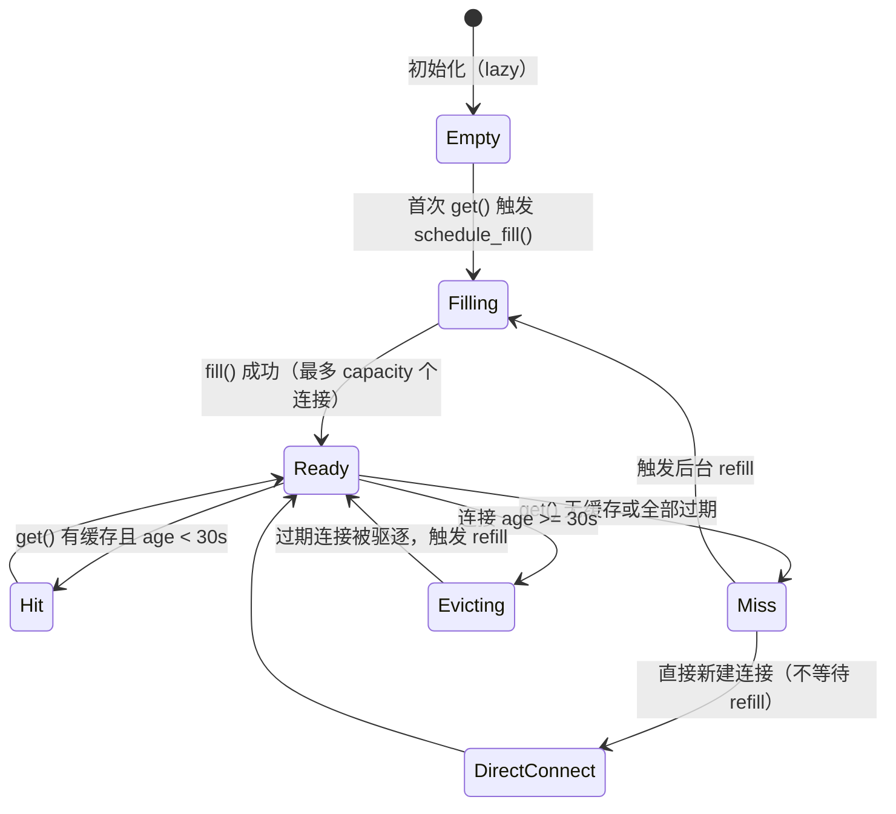
```mermaid
stateDiagram-v2
    [*] --> Empty: 初始化（lazy）

    Empty --> Filling: 首次 get() 触发 schedule_fill()
    Filling --> Ready: fill() 成功（最多 capacity 个连接）

    Ready --> Hit: get() 有缓存且 age < 30s
    Ready --> Miss: get() 无缓存或全部过期

    Miss --> Filling: 触发后台 refill
    Miss --> DirectConnect: 直接新建连接（不等待 refill）

    Hit --> Ready
    DirectConnect --> Ready

    Ready --> Evicting: 连接 age >= 30s
    Evicting --> Ready: 过期连接被驱逐，触发 refill
```

**关键参数**：
- `capacity = 4`：预建连接数
- `max_age = 30s`：连接最大存活时间
- `refill_delay = 50ms`：每次 fill 尝试的间隔，避免惊群

**注意**：ConnPool 仅用于 TCP-based 协议。QUIC 协议（TUIC/Hysteria2）通过 `RwLock<Option<Connection>>` 管理单一持久 QUIC 连接。

---

## 10. 双向中继实现（relay_bidirectional）

```rust
// relay.rs
pub async fn relay_bidirectional<A, B>(
    a: &mut A,
    b: &mut B,
) -> io::Result<(u64, u64)>
where A: AsyncRead + AsyncWrite + Unpin + ?Sized,
      B: AsyncRead + AsyncWrite + Unpin + ?Sized,
{
    const BUF_SIZE: usize = 64 * 1024;  // 64KB，8× tokio 默认值
    // 两个方向同时 poll，select! 哪个先有数据
}
```

### 10.1 Relay Future 内部结构

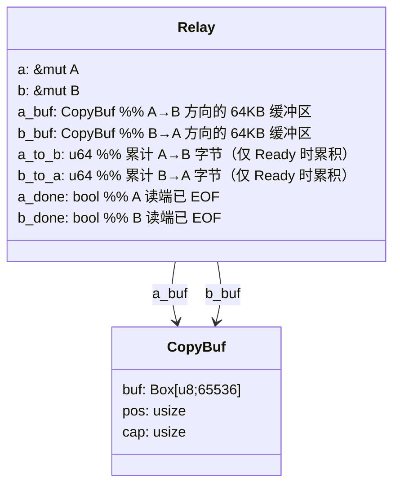
```mermaid
classDiagram
    class Relay {
        a: &mut A
        b: &mut B
        a_buf: CopyBuf   %% A→B 方向的 64KB 缓冲区
        b_buf: CopyBuf   %% B→A 方向的 64KB 缓冲区
        a_to_b: u64      %% 累计 A→B 字节（仅 Ready 时累积）
        b_to_a: u64      %% 累计 B→A 字节（仅 Ready 时累积）
        a_done: bool     %% A 读端已 EOF
        b_done: bool     %% B 读端已 EOF
    }
    class CopyBuf {
        buf: Box[u8;65536]
        pos: usize
        cap: usize
    }
    Relay --> CopyBuf : a_buf
    Relay --> CopyBuf : b_buf
```

### 10.2 transfer_one 状态机

`transfer_one(cx, reader, writer, buf, done)` 在单次 `poll()` 调用中尽可能传输数据：

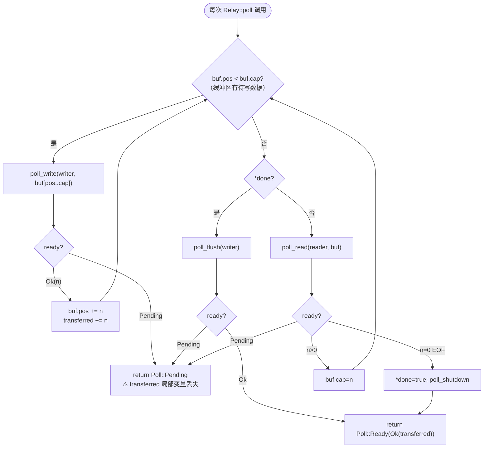
```mermaid
flowchart TD
    Start([每次 Relay::poll 调用]) --> Check1{"buf.pos < buf.cap?\n（缓冲区有待写数据）"}
    Check1 -->|"是"| Write["poll_write(writer, buf[pos..cap])"]
    Write --> W1{"ready?"}
    W1 -->|"Pending"| RetPending["return Poll::Pending\n⚠️ transferred 局部变量丢失"]
    W1 -->|"Ok(n)"| Acc["buf.pos += n\ntransferred += n"]
    Acc --> Check1
    Check1 -->|"否"| CheckDone{"*done?"}
    CheckDone -->|"是"| Flush["poll_flush(writer)"]
    Flush --> F1{"ready?"}
    F1 -->|"Pending"| RetPending
    F1 -->|"Ok"| RetReady["return Poll::Ready(Ok(transferred))"]
    CheckDone -->|"否"| Read["poll_read(reader, buf)"]
    Read --> R1{"ready?"}
    R1 -->|"Pending"| RetPending
    R1 -->|"n=0 EOF"| SetDone["*done=true; poll_shutdown"] --> RetReady
    R1 -->|"n>0"| SetCap["buf.cap=n"] --> Check1
```

> **⚠️ 统计字节 Bug**：`transferred` 是 `transfer_one` 内的局部变量，在每次调用时从 0 开始。当 `poll_write` 返回 `Pending`（写入被内核缓冲区阻塞），即使此次迭代已经写出部分数据（`transferred > 0`），这些字节数也随 `Poll::Pending` 丢失，不会被 `Relay::a_to_b` 累积。对于 MB 级别的传输，最终 `ProxyStats.bytes_sent/bytes_received` 只会反映连接最后一个 `transfer_one` 周期内的字节数（通常 < 64KB），远低于实际传输量。

### 10.3 优雅关闭序列

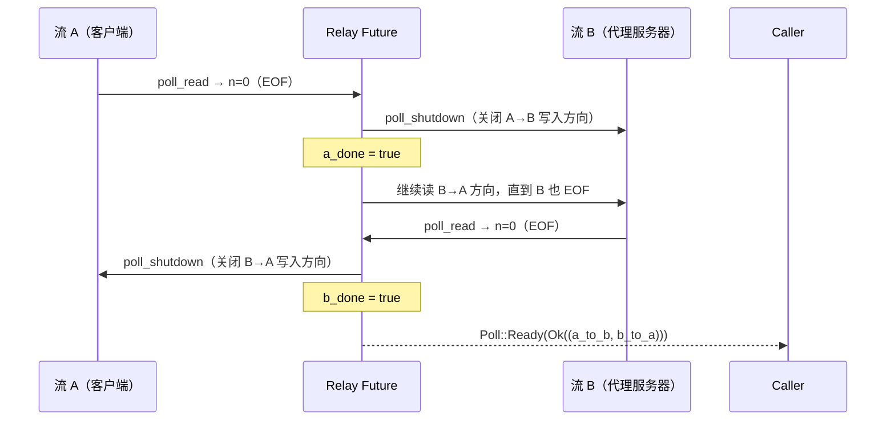
```mermaid
sequenceDiagram
    participant A as 流 A（客户端）
    participant R as Relay Future
    participant B as 流 B（代理服务器）

    A->>R: poll_read → n=0（EOF）
    R->>B: poll_shutdown（关闭 A→B 写入方向）
    Note over R: a_done = true
    R->>B: 继续读 B→A 方向，直到 B 也 EOF
    B->>R: poll_read → n=0（EOF）
    R->>A: poll_shutdown（关闭 B→A 写入方向）
    Note over R: b_done = true
    R-->>Caller: Poll::Ready(Ok((a_to_b, b_to_a)))
```

**设计要点**：
- 64KB 缓冲区：减少系统调用频率，提升吞吐量（参考 Clash 实现）
- 全双工：两个方向同时监听，不阻塞彼此
- 优雅关闭：收到 EOF 时 `poll_shutdown` 通知对端写半部关闭，等待另一方向完成
- 返回值：`(bytes_a→b, bytes_b→a)` 理论上用于统计，但因上述 Bug 实际值偏低

---

## 11. 本地代理服务：SOCKS5 + HTTP

### 11.1 SOCKS5 服务器（socks5.rs）

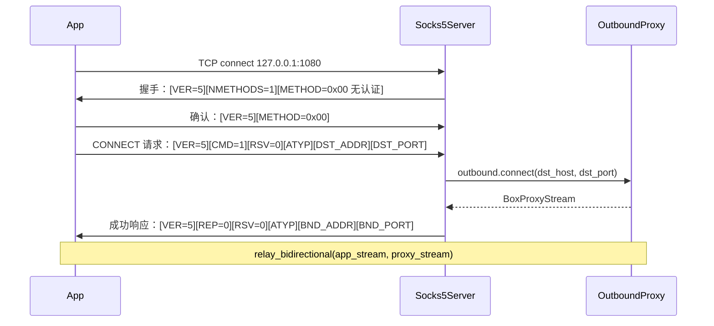
```mermaid
sequenceDiagram
    participant App
    participant Socks5Server
    participant OutboundProxy

    App->>Socks5Server: TCP connect 127.0.0.1:1080
    Socks5Server->>App: 握手：[VER=5][NMETHODS=1][METHOD=0x00 无认证]
    App->>Socks5Server: 确认：[VER=5][METHOD=0x00]
    App->>Socks5Server: CONNECT 请求：[VER=5][CMD=1][RSV=0][ATYP][DST_ADDR][DST_PORT]
    Socks5Server->>OutboundProxy: outbound.connect(dst_host, dst_port)
    OutboundProxy-->>Socks5Server: BoxProxyStream
    Socks5Server->>App: 成功响应：[VER=5][REP=0][RSV=0][ATYP][BND_ADDR][BND_PORT]
    Note over App,OutboundProxy: relay_bidirectional(app_stream, proxy_stream)
```

**限制**：仅支持 SOCKS5 CMD_CONNECT（0x01）。CMD_ASSOCIATE（UDP）已接受但返回固定 BND_ADDR，实际 UDP 转发未完整实现。

### 11.2 HTTP 代理服务器（http.rs）

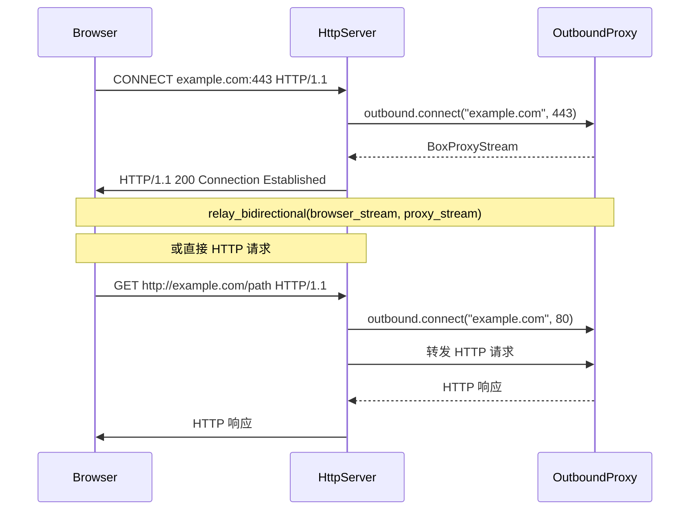
```mermaid
sequenceDiagram
    participant Browser
    participant HttpServer
    participant OutboundProxy

    Browser->>HttpServer: CONNECT example.com:443 HTTP/1.1
    HttpServer->>OutboundProxy: outbound.connect("example.com", 443)
    OutboundProxy-->>HttpServer: BoxProxyStream
    HttpServer->>Browser: HTTP/1.1 200 Connection Established
    Note over Browser,OutboundProxy: relay_bidirectional(browser_stream, proxy_stream)

    Note over Browser,HttpServer: 或直接 HTTP 请求
    Browser->>HttpServer: GET http://example.com/path HTTP/1.1
    HttpServer->>OutboundProxy: outbound.connect("example.com", 80)
    HttpServer->>OutboundProxy: 转发 HTTP 请求
    OutboundProxy-->>HttpServer: HTTP 响应
    HttpServer->>Browser: HTTP 响应
```

**最大请求头**：8192 字节。不缓存响应，不解析 body。

---

## 12. 路由引擎（Router / RuleSet）

### 12.1 规则评估流程

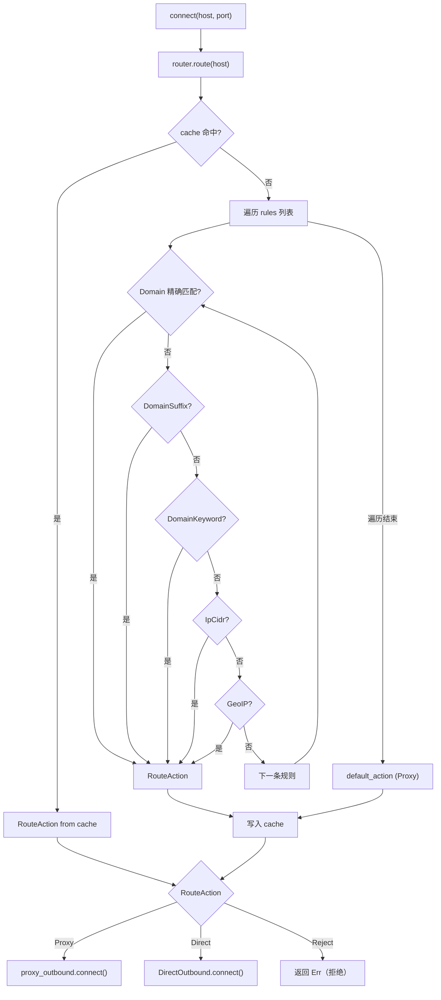
```mermaid
flowchart TD
    A["connect(host, port)"] --> B["router.route(host)"]
    B --> C{"cache 命中?"}
    C -->|"是"| D["RouteAction from cache"]
    C -->|"否"| E["遍历 rules 列表"]
    E --> F{"Domain 精确匹配?"}
    F -->|"是"| G["RouteAction"]
    F -->|"否"| H{"DomainSuffix?"}
    H -->|"是"| G
    H -->|"否"| I{"DomainKeyword?"}
    I -->|"是"| G
    I -->|"否"| J{"IpCidr?"}
    J -->|"是"| G
    J -->|"否"| K{"GeoIP?"}
    K -->|"是"| G
    K -->|"否"| L["下一条规则"]
    L --> F
    E -->|"遍历结束"| M["default_action (Proxy)"]
    G --> N["写入 cache"]
    M --> N
    D --> O{"RouteAction"}
    N --> O
    O -->|"Proxy"| P["proxy_outbound.connect()"]
    O -->|"Direct"| Q["DirectOutbound.connect()"]
    O -->|"Reject"| R["返回 Err（拒绝）"]
```

### 12.2 路由缓存

```rust
// router/engine.rs
struct Router {
    rules: RuleSet,
    geoip: Option<Arc<GeoIpDb>>,
    cache: RwLock<HashMap<String, RouteAction>>,  // 容量 4096
}
```

**注意**：当前 cache 使用 `HashMap`，未实现真正的 LRU 驱逐策略。在域名数量超过 4096 时，cache 会持续增长（见 [优化路线图](./optimization-roadmap.mdx#路由缓存内存泄漏)）。

---

## 13. DNS 解析器（DnsResolver）

### 13.1 架构

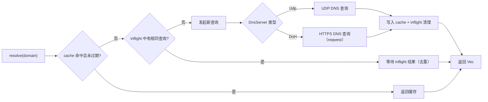
```mermaid
flowchart LR
    A["resolve(domain)"] --> B{"cache 命中且未过期?"}
    B -->|"是"| C["返回缓存"]
    B -->|"否"| D{"inflight 中有相同查询?"}
    D -->|"是"| E["等待 inflight 结果（去重）"]
    D -->|"否"| F["发起新查询"]
    F --> G{"DnsServer 类型"}
    G -->|"Udp"| H["UDP DNS 查询"]
    G -->|"DoH"| I["HTTPS DNS 查询（reqwest）"]
    H --> J["写入 cache + inflight 清理"]
    I --> J
    J --> K["返回 Vec<IpAddr>"]
    E --> K
    C --> K
```

### 13.2 配置参数

```rust
pub struct DnsConfig {
    pub primary: Vec<DnsServer>,      // 主 DNS（Google/Cloudflare）
    pub fallback: Vec<DnsServer>,     // 备用 DNS（阿里/腾讯）
    pub cache_ttl: Duration,          // 默认 300s
    pub enable_doh: bool,             // DNS-over-HTTPS
}

pub enum DnsServer {
    Udp(SocketAddr),                  // "8.8.8.8:53"
    DoH(String),                      // "https://cloudflare-dns.com/dns-query"
}
```

**Stale-while-revalidate**：cache 命中但 TTL 过期时，返回 stale 值并在后台刷新，避免同步等待 DNS 查询延迟。

---

## 14. 代理服务编排（ProxyService）

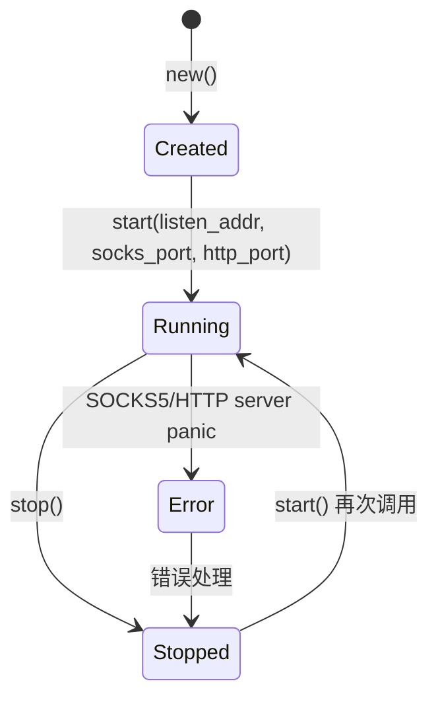
```mermaid
stateDiagram-v2
    [*] --> Created: new()

    Created --> Running: start(listen_addr, socks_port, http_port)
    Running --> Stopped: stop()
    Stopped --> Running: start() 再次调用

    Running --> Error: SOCKS5/HTTP server panic
    Error --> Stopped: 错误处理
```

```rust
pub struct ProxyService {
    state_tx: watch::Sender<ProxyState>,
    shutdown_tx: Option<watch::Sender<bool>>,  // 发送 true 触发优雅停机
    socks5_handle: Option<JoinHandle<()>>,
    http_handle: Option<JoinHandle<()>>,
    stats: ProxyStats,
    outbound: SharedOutbound,
}
```

**启动序列**：
1. 绑定端口：`Socks5Server::bind()` + `HttpProxyServer::bind()`
2. 创建 `shutdown_tx` channel
3. Spawn SOCKS5 task（持有 `shutdown_rx` clone）
4. Spawn HTTP task（持有 `shutdown_rx` clone）
5. 更新 `state_tx` → `ProxyState::Connected`

**停止序列**：
1. `shutdown_tx.send(true)` → 两个 server task 收到信号退出
2. Drop handles（不 await，非阻塞）
3. 更新 `state_tx` → `ProxyState::Disconnected`

---

## 15. GUI 状态机（AppState）

文件：`crates/xtune-gui/src/app.rs`（约 3800 行）

### 15.1 核心状态字段

```rust
pub struct AppState {
    // 代理运行状态
    proxy_running: bool,
    proxy_status: String,               // 显示给用户的状态文本
    proxy_validation_status: String,    // 连通性验证结果
    proxy_session_id: u64,              // 并发启动去重 ID
    proxy_stop_tx: Option<oneshot::Sender<()>>,

    // 节点
    nodes: Vec<Node>,
    selected_node: Option<usize>,
    active_proxy_node: Option<usize>,
    latency_testing: HashSet<usize>,
    latency_semaphore: Arc<Semaphore>,  // cap=5

    // 路由模式
    proxy_mode: ProxyMode,              // Global | Rule | Direct

    // 系统设置
    listen_addr: String,
    socks_port: u16,
    http_port: u16,
    system_proxy_enabled: bool,
    system_proxy_managed_by_app: bool,

    // UI 视图
    active_view: ActiveView,            // Home|Nodes|Config|Rules|Settings|Logs

    // 异步
    tokio_handle: tokio::runtime::Handle,
    log_buffer: SharedLogBuffer,
}
```

### 15.2 代理状态机

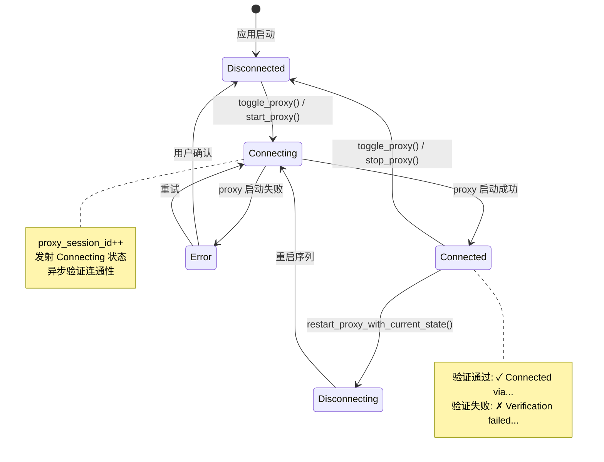
```mermaid
stateDiagram-v2
    [*] --> Disconnected: 应用启动

    Disconnected --> Connecting: toggle_proxy() / start_proxy()
    Connecting --> Connected: proxy 启动成功
    Connecting --> Error: proxy 启动失败
    Connected --> Disconnected: toggle_proxy() / stop_proxy()
    Connected --> Disconnecting: restart_proxy_with_current_state()
    Disconnecting --> Connecting: 重启序列
    Error --> Disconnected: 用户确认
    Error --> Connecting: 重试

    note right of Connecting
        proxy_session_id++
        发射 Connecting 状态
        异步验证连通性
    end note

    note right of Connected
        验证通过: ✓ Connected via...
        验证失败: ✗ Verification failed...
    end note
```

### 15.3 start_proxy 详细流程

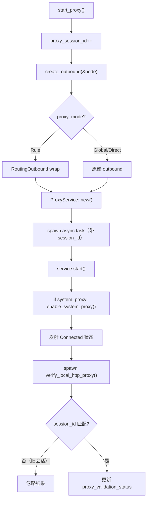
```mermaid
flowchart TD
    A["start_proxy()"] --> B["proxy_session_id++"]
    B --> C["create_outbound(&node)"]
    C --> D{"proxy_mode?"}
    D -->|"Rule"| E["RoutingOutbound wrap"]
    D -->|"Global/Direct"| F["原始 outbound"]
    E --> G["ProxyService::new()"]
    F --> G
    G --> H["spawn async task（带 session_id）"]
    H --> I["service.start()"]
    I --> J["if system_proxy: enable_system_proxy()"]
    J --> K["发射 Connected 状态"]
    K --> L["spawn verify_local_http_proxy()"]
    L --> M{"session_id 匹配?"}
    M -->|"否（旧会话）"| N["忽略结果"]
    M -->|"是"| O["更新 proxy_validation_status"]
```

**session_id 的作用**：防止快速 start/stop/start 时旧验证任务的结果覆盖新会话的状态。

### 15.4 stop_proxy 详细流程

```rust
fn stop_proxy(&mut self, cx: &mut Context<Self>) {
    // 1. 停止 TUN（如果活跃）
    if self.tun_enabled { self.stop_tun(cx); }

    // 2. 清除系统代理（如果 app 设置的）
    if self.system_proxy_managed_by_app {
        let _ = sysproxy::Sysproxy::set_enabled(false);
    }

    // 3. 发送停止信号（非阻塞）
    if let Some(tx) = self.proxy_stop_tx.take() {
        let _ = tx.send(());
    }

    // 4. 立即更新状态
    self.proxy_running = false;
    self.proxy_status = "Disconnected".to_string();
    self.active_proxy_node = None;
    cx.notify();
}
```

**关键**：`stop_proxy` 不 await 任何 future，立即返回。旧版实现会等待连通性验证超时（最高 24s），现在通过 `session_id` 机制让验证任务自行终止。

---

## 16. 延迟测试流水线

```mermaid
sequenceDiagram
    participant UI
    participant AppState
    participant Semaphore
    participant Speedtest

    UI->>AppState: test_node_latency(index)
    AppState->>AppState: latency_testing.insert(index)
    AppState->>AppState: node.latency_ms = None（清除旧值）
    AppState->>AppState: cx.notify()（显示 spinner）

    AppState->>AppState: spawn tokio task

    Note over AppState,Semaphore: 在 tokio task 内
    AppState->>Semaphore: acquire_owned().await（最多 5 个并发）
    Semaphore-->>AppState: permit

    AppState->>Speedtest: 并发执行
    par TCP 延迟
        Speedtest->>Speedtest: tcp_latency_test(server, port, 5s)
    and HTTP 延迟
        Speedtest->>Speedtest: http_latency_test(outbound, 10s)
    end

    Speedtest-->>AppState: (tcp_result, http_result)

    Note over AppState: 结果选择逻辑:
    Note over AppState: HTTP 成功 → 用 HTTP 延迟
    Note over AppState: HTTP 失败，TCP 成功 → 用 TCP 延迟
    Note over AppState: 两者均失败 → 9999ms

    AppState->>AppState: node.latency_ms = Some(ms)
    AppState->>AppState: latency_testing.remove(index)
    AppState->>AppState: persist_gui_state()
    AppState->>UI: cx.notify()（更新显示）
```

### http_latency_test 内部流程

```
Phase A: 预热（non-fatal）
  ├── connect("www.gstatic.com", 80) [timeout: 10s]
  ├── 发送 GET /generate_204 HTTP/1.1
  ├── 读取最多 128 字节响应
  └── 失败 → 记录 debug log，继续

Phase B: 计时测量
  ├── start = Instant::now()
  ├── connect("www.gstatic.com", 80) [timeout: 10s]  ← 计时开始
  ├── 发送 GET /generate_204 HTTP/1.1
  ├── 读取最多 128 字节响应                          ← 计时结束
  └── 返回 elapsed().as_millis() as u32
```

**预热的意义**：对 QUIC 协议（TUIC/Hysteria2），预热阶段建立 QUIC session；测量阶段使用已建立的会话，得到更准确的数据传输延迟（而非握手延迟）。对 TCP 协议预热意义有限，但不影响准确性。

---

## 17. 连通性验证流程

在代理启动后（`Connected` 状态），GUI 自动运行验证以确认代理真正可用：

```mermaid
sequenceDiagram
    participant GUI
    participant Verify as verify_local_http_proxy()
    participant Proxy as 本地代理（SOCKS5/HTTP）
    participant Internet

    GUI->>Verify: spawn（6s 整体超时）

    par 目标 A
        Verify->>Proxy: TCP connect 127.0.0.1:http_port（2s）
        Proxy->>Internet: CONNECT www.gstatic.com:443
        Internet-->>Proxy: 200 OK
        Proxy-->>Verify: TCP OK
        Verify->>Internet: TLS 握手（剩余时间）
        Internet-->>Verify: TLS 证书
        Verify-->>GUI: "✓ Connected via www.gstatic.com"
    and 目标 B
        Verify->>Proxy: TCP connect 127.0.0.1:http_port（2s）
        Proxy->>Internet: CONNECT cp.cloudflare.com:443
        Internet-->>Proxy: 200 OK
        Proxy-->>Verify: TCP OK
        Verify->>Internet: TLS 握手（剩余时间）
        Internet-->>Verify: TLS 证书
        Verify-->>GUI: "✓ Connected via cp.cloudflare.com"
    end

    Note over GUI: 取最先返回的成功结果
```

**降级处理**：若 TLS 握手超时（网络延迟高），`verify_local_http_proxy_once` 返回 `Ok("Connected — tunnel established")` 而非 `Err`，避免因 TLS 慢导致误判为"代理不可用"。

---

## 18. 统计采集（ProxyStats）

```rust
// proxy/mod.rs
pub struct ProxyStats(Arc<StatsInner>);

struct StatsInner {
    active_connections: AtomicU64,
    total_connections: AtomicU64,
    bytes_sent: AtomicU64,
    bytes_received: AtomicU64,
}
```

采集点：

| 事件 | 操作 | 位置 |
|------|------|------|
| 新连接建立 | `stats.add_connection()` | socks5.rs / http.rs handle 函数 |
| 连接关闭 | `stats.remove_connection()` | relay_bidirectional 返回后 |
| 数据传输 | `stats.add_bytes(sent, recv)` | relay_bidirectional 返回值中 |

GUI 在 Home 视图展示：活跃连接数、总连接数、上传/下载流量（人类可读格式）。

```mermaid
sequenceDiagram
    participant App as 用户应用
    participant S5 as Socks5Server
    participant R as relay_bidirectional
    participant Stats as ProxyStats

    App->>S5: 新连接
    S5->>Stats: add_connection() → active++, total++
    S5->>R: relay_bidirectional(a, b).await
    Note over R: 传输数据（可能传输数 MB）
    R-->>S5: Ok((a_to_b, b_to_a))
    S5->>Stats: add_bytes(a_to_b, b_to_a)
    Note over Stats: ⚠️ a_to_b/b_to_a 仅反映最后一个<br/>transfer_one 周期的字节数<br/>对大传输严重低估
    S5->>Stats: remove_connection() → active--
```

> **已知 Bug**：`bytes_sent` / `bytes_received` 因 relay 统计 Bug（§10）严重低于实际传输量。修复前，GUI 显示的 ↑/↓ 流量数字不可信。

---

## 19. 完整连接数据流（TUIC 示例）

```mermaid
flowchart LR
    subgraph UserApp["用户应用 (Browser/App)"]
        UA["发起 HTTP/HTTPS 请求"]
    end

    subgraph LocalProxy["本地代理层"]
        S5["Socks5Server\n127.0.0.1:1080"]
        HTTP["HttpProxyServer\n127.0.0.1:1087"]
    end

    subgraph Routing["路由层（可选）"]
        RO["RoutingOutbound\n根据域名/IP 路由"]
        Router["Router\n规则匹配 + LRU缓存"]
    end

    subgraph OutboundLayer["出站层"]
        TUIC["TuicOutbound\nget_connection()\nopen_bi()\n发送 CONNECT 帧"]
    end

    subgraph Transport["传输层"]
        QUIC["QUIC (quinn)\nUDP 多路复用流"]
    end

    subgraph Remote["远端"]
        Server["TUIC Server\n远端代理服务器"]
        Target["目标网站\nexample.com:443"]
    end

    UA -->|"SOCKS5 CONNECT"| S5
    UA -->|"HTTP CONNECT"| HTTP
    S5 -->|"outbound.connect()"| RO
    HTTP -->|"outbound.connect()"| RO
    RO -->|"route(host)"| Router
    Router -->|"Proxy"| TUIC
    TUIC -->|"UDP 数据包"| QUIC
    QUIC -->|"加密 UDP"| Server
    Server -->|"TCP 连接"| Target
    Target -->|"响应"| Server
    Server -->|"加密 UDP"| QUIC
    QUIC --> TUIC
    TUIC --> S5
    S5 --> UA
```

**关键数据转换**：
```
[用户 TCP 数据]
    ↓ SOCKS5/HTTP 解析
[目标地址 + payload]
    ↓ TuicOutbound.connect()
[QUIC 流 (TUIC CONNECT 帧 + payload)]
    ↓ quinn QUIC 加密
[加密 UDP 数据报]
    ↓ 网络传输
[TUIC Server 解密]
[目标 TCP 连接]
```

---

## 20. TUN 模式

TUN 模式拦截系统所有网络流量（需要管理员权限）：

```mermaid
flowchart TD
    subgraph OS["操作系统网络栈"]
        App["用户应用（浏览器等）"]
        TCPStack["OS TCP/IP 栈"]
    end

    subgraph TUN["TUN 虚拟网卡"]
        WinTun["WinTun.dll（Windows）\n/ Linux kernel tun"]
        IPStack["ipstack crate\nIP 数据包 → TCP 连接流"]
    end

    subgraph Core["xtune-core"]
        Router["路由引擎\nDomain/IP/GeoIP 匹配"]
        Outbound["协议 Outbound\n(TUIC/Hy2/VLESS/...)"]
    end

    subgraph Remote["远端"]
        ProxyServer["代理服务器"]
        Target["目标网站"]
    end

    App -->|"TCP 数据包"| TCPStack
    TCPStack -->|"路由至 TUN 接口"| WinTun
    WinTun -->|"原始 IP 帧"| IPStack
    IPStack -->|"重建 TCP 流"| Router
    Router -->|"Proxy"| Outbound
    Router -->|"Direct"| DirectTCP["直连 TCP"]
    Router -->|"Reject"| Drop["丢弃"]
    Outbound -->|"加密协议"| ProxyServer
    ProxyServer -->|"转发"| Target
```

**系统路由修改**：

```mermaid
sequenceDiagram
    participant App as xtune-gui
    participant OS as 操作系统路由表
    participant TUN as TUN 设备

    App->>TUN: 创建 TUN 设备（分配 IP 10.0.0.1/24）
    App->>OS: ip route add 0.0.0.0/0 dev tun0
    Note over OS: 所有流量路由至 TUN 接口
    App->>OS: ip route add <proxy_server_ip>/32 via <原网关>
    Note over OS: 代理服务器本身直连（避免循环）

    Note over App,OS: 代理运行期间...

    App->>OS: ip route del 0.0.0.0/0 dev tun0（恢复默认路由）
    App->>TUN: 关闭 TUN 设备
```

**紧急恢复**：`emergency_restore_routes()` 在以下情况被调用：
- 正常关闭（`cleanup_on_exit()`）
- `Ctrl+C` 信号处理
- Windows `CTRL_CLOSE_EVENT` / `CTRL_SHUTDOWN_EVENT`
- panic hook

---

## 21. 并发模型：GPUI + tokio

```mermaid
graph TB
    subgraph MainThread["主线程（GPUI 事件循环）"]
        GPUI["GPUI Runtime\n(GPU 渲染 + 事件分发)"]
        AppState["AppState\n(所有 GUI 状态的唯一 owner)"]
        GPUI -->|"cx.update()"| AppState
    end

    subgraph TokioPool["tokio 运行时（2 worker 线程）"]
        W1["Worker Thread 1"]
        W2["Worker Thread 2"]
        Tasks["并发任务池\n• 延迟测试任务 (×N)\n• 连通性验证任务\n• 订阅拉取任务\n• ProxyService 网络任务"]
        W1 & W2 --> Tasks
    end

    subgraph ProxyTasks["ProxyService 任务（tokio spawn）"]
        SOCKS5T["Socks5Server task\n监听 127.0.0.1:1080"]
        HTTPT["HttpProxyServer task\n监听 127.0.0.1:1087"]
        ConnTasks["每个连接 → 独立 task\nrelay_bidirectional"]
        SOCKS5T & HTTPT --> ConnTasks
    end

    AppState -->|"tokio_handle.spawn(async { ... })"| Tasks
    Tasks -->|"weak_handle.update(cx, |this, cx| ...);\n回调到主线程"| AppState
    Tasks --> ProxyTasks
```

**线程安全保证**：

| 组件 | 线程 | 访问方式 |
|------|------|---------|
| `AppState` 所有字段 | 仅 GPUI 主线程 | `cx.update()` 序列化 |
| `ProxyStats` | 任意线程 | `AtomicU64` |
| `TuicOutbound.state` | 任意 tokio 线程 | `tokio::RwLock` |
| `ConnPool.connections` | 任意 tokio 线程 | `tokio::Mutex` |
| `DnsResolver.cache` | 任意 tokio 线程 | `tokio::Mutex` |
| `Router.cache` | 任意 tokio 线程 | `tokio::RwLock` |

**tokio workers 固定为 2**（`main.rs` 硬编码）：对代理场景（I/O 密集）够用；纯 CPU 密集型任务（GeoIP 匹配 + 路由规则遍历）在 2 个 worker 上轻度竞争。

---

## 22. 订阅管理流程

```mermaid
flowchart TD
    A["用户点击「刷新订阅」"] --> B["GUI spawn tokio task"]
    B --> C["fetch_subscription(sub)"]
    C --> D["reqwest GET {sub.url}\n超时 30s\nUser-Agent: XTune/0.1\n允许无效证书"]
    D --> E{"HTTP 状态?"}
    E -->|"非 2xx"| F["Err: Subscription returned HTTP {status}"]
    E -->|"2xx"| G["读取响应体文本"]
    G --> H["parse_subscription_content(content, format_hint)"]
    H --> I{"format_hint?"}
    I -->|"clash"| J["parse_clash_config()"]
    I -->|"singbox"| K["parse_singbox_config()"]
    I -->|"v2ray"| L["parse_v2ray_config()"]
    I -->|"base64"| M["parse_base64_lines()"]
    I -->|"auto"| N["detect_format()"]
    N --> O{"内容特征?"}
    O -->|"proxies: 开头"| J
    O -->|"{ + outbounds"| K
    O -->|"{ + inbounds"| L
    O -->|"first line 含 ://"| P["parse_plain_lines()"]
    O -->|"纯 Base64 字符"| Q["Base64 解码 → 递归检测"]
    Q --> J & P
    J & K & L & P & M --> R["Vec<Node>"]
    R --> S["GUI 主线程: 合并节点列表"]
    S --> T["persist_gui_state()"]
```

**支持的节点 URI 格式**：`vmess://`、`vless://`、`trojan://`、`ss://`（AES/2022）、`hysteria2://`/`hy2://`、`tuic://`

---

## 23. RetryOutbound 退避时序

```mermaid
sequenceDiagram
    participant Caller
    participant Retry as RetryOutbound (max=3)
    participant Inner as 内层 Outbound (TCP)
    participant Server as 代理服务器

    Caller->>Retry: connect(host, port)

    Note over Retry: attempt 1 (立即)
    Retry->>Inner: connect()
    Inner->>Server: TCP 连接 [超时 10s]
    Server-->>Inner: Err / timeout
    Inner-->>Retry: Err

    Note over Retry: sleep 200ms (base_delay * 2^0)
    Retry->>Retry: sleep(200ms)

    Note over Retry: attempt 2
    Retry->>Inner: connect()
    Inner->>Server: TCP 连接 [超时 10s]
    Server-->>Inner: Err / timeout
    Inner-->>Retry: Err

    Note over Retry: sleep min(200ms*2, 2000ms) = 400ms
    Retry->>Retry: sleep(400ms)

    Note over Retry: attempt 3
    Retry->>Inner: connect()
    Inner->>Server: TCP 连接 [超时 10s]
    Server-->>Inner: Ok(stream)
    Inner-->>Retry: Ok(stream)
    Retry-->>Caller: Ok(BoxProxyStream)

    Note over Retry,Caller: 最坏情况: 10s + 200ms + 10s + 400ms + 10s = 30.6s
```

**仅 TCP 协议使用 RetryOutbound**；QUIC 协议（TUIC/Hysteria2）内部管理重连，最坏情况 14s（2 地址 × 2 尝试 × 7s 超时）。

---

*文档生成时间：基于 commit `e5d05d8`*
