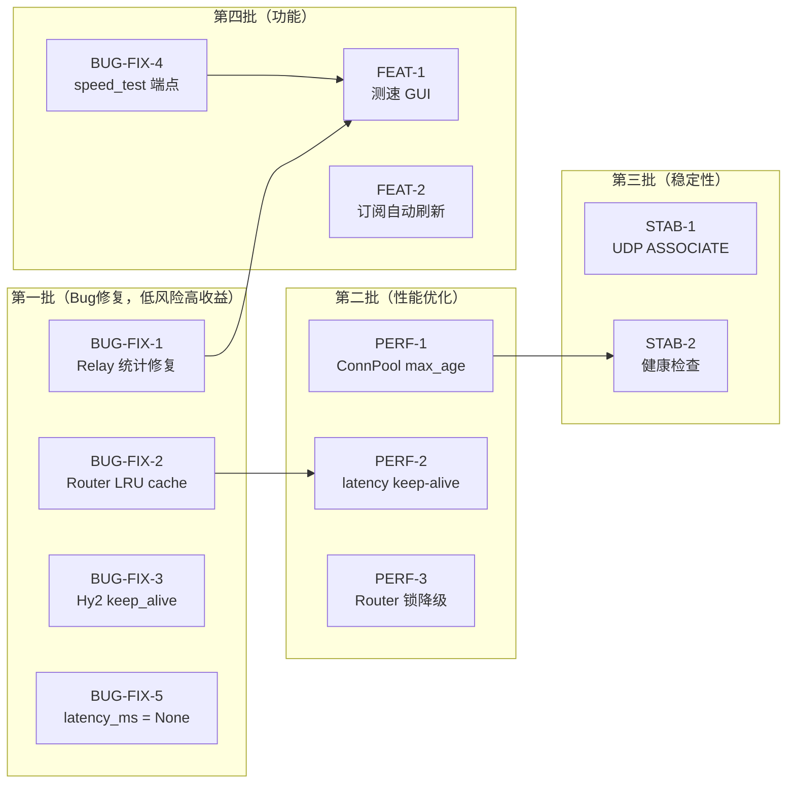
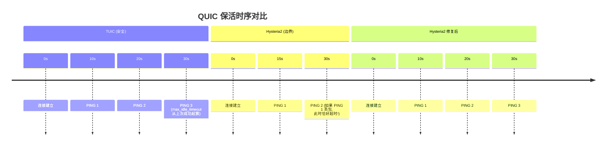
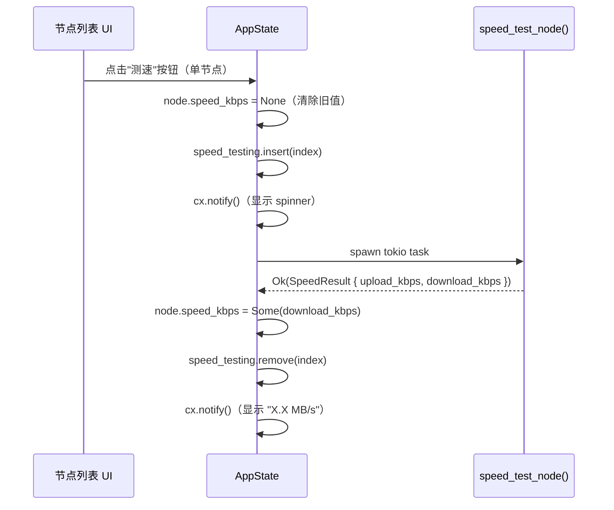
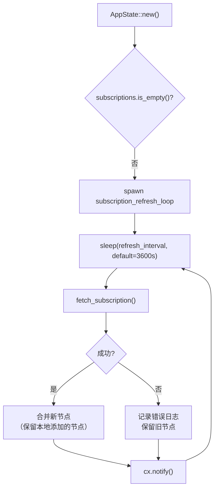

# XTune 优化实施指南

> 本文从代码审查和架构分析中提炼优化策略，每项均包含：**问题根源 → 影响评估 → 具体实现方案 → 推荐测试**。
> 所有条目已按"实施收益 / 实施成本"排序，优先处理高收益低成本的改进。

---

## 目录

1. [实施路线图（全局视图）](#1-实施路线图全局视图)
2. [BUG-FIX-1：Relay 统计字节修复](#2-bug-fix-1relay-统计字节修复)
3. [BUG-FIX-2：Router Cache 全量清除 → LRU](#3-bug-fix-2router-cache-全量清除--lru)
4. [BUG-FIX-3：Hysteria2 keep_alive 边界值修正](#4-bug-fix-3hysteria2-keep_alive-边界值修正)
5. [BUG-FIX-4：speed_test_node 测速端点修复](#5-bug-fix-4speed_test_node-测速端点修复)
6. [BUG-FIX-5：latency_ms 失败时写 None 而非 9999](#6-bug-fix-5latency_ms-失败时写-none-而非-9999)
7. [PERF-1：ConnPool max_age 降低与存活探测](#7-perf-1connpool-max_age-降低与存活探测)
8. [PERF-2：http_latency_test 复用 Keep-Alive 连接](#8-perf-2http_latency_test-复用-keep-alive-连接)
9. [PERF-3：Router 写锁降级（读改写 → 乐观写）](#9-perf-3router-写锁降级读改写--乐观写)
10. [STAB-1：UDP ASSOCIATE 返回正确错误码](#10-stab-1udp-associate-返回正确错误码)
11. [STAB-2：代理健康检查与自动重启](#11-stab-2代理健康检查与自动重启)
12. [STAB-3：DNS stale-while-revalidate inflight 共享](#12-stab-3dns-stale-while-revalidate-inflight-共享)
13. [FEAT-1：测速 GUI 集成](#13-feat-1测速-gui-集成)
14. [FEAT-2：订阅定时自动刷新](#14-feat-2订阅定时自动刷新)
15. [TEST-1：补充测试覆盖](#15-test-1补充测试覆盖)

---

## 1. 实施路线图（全局视图）



**优先级说明**：
- P1 Bug 修复对现有用户体验影响最大，且代码改动小（均 < 30 行）
- P2 性能优化在流量高峰时有感，但当前场景下用户感知可能有限
- P3/P4 为新功能或边缘情况改善

---

## 2. BUG-FIX-1：Relay 统计字节修复

**文件**：`crates/xtune-core/src/proxy/relay.rs`

**根因**（见 [deep-analysis.mdx §3](./deep-analysis.mdx#3-relay-统计计数-bug跨-poll-丢失字节)）：
`transfer_one` 内的 `transferred: u64` 是局部变量，每次 `poll()` 重置为 0。当 `poll_write` 返回 `Pending`，已写字节数被丢弃。

**影响**：GUI 的 ↑/↓ 流量统计几乎永远为 0 或极小值，对大文件传输误差 > 99%。

### 实现方案

修改 `transfer_one` 签名，通过 `&mut u64` 参数跨 poll 累积：

```rust
// 修改前
fn transfer_one<R, W>(
    cx: &mut Context<'_>,
    reader: &mut R,
    writer: &mut W,
    buf: &mut CopyBuf,
    done: &mut bool,
) -> Poll<io::Result<u64>>

// 修改后
fn transfer_one<R, W>(
    cx: &mut Context<'_>,
    reader: &mut R,
    writer: &mut W,
    buf: &mut CopyBuf,
    done: &mut bool,
    total: &mut u64,      // ← 新增：跨 poll 的累积计数器
) -> Poll<io::Result<()>> // ← 返回值不再含字节数
```

在 `Relay` struct 中，`a_to_b` / `b_to_a` 本身充当累积计数器，直接传入：

```rust
// Relay::poll 中
let a_to_b_poll = if !this.a_done || this.a_buf.pos < this.a_buf.cap {
    transfer_one(cx, this.a, this.b, &mut this.a_buf, &mut this.a_done, &mut this.a_to_b)
} else {
    Poll::Ready(Ok(()))
};
```

在 `transfer_one` 内，每次写入成功立即累积：

```rust
fn transfer_one<R, W>(
    cx: &mut Context<'_>,
    reader: &mut R,
    writer: &mut W,
    buf: &mut CopyBuf,
    done: &mut bool,
    total: &mut u64,
) -> Poll<io::Result<()>> {
    loop {
        if buf.pos < buf.cap {
            let n = ready!(Pin::new(&mut *writer).poll_write(cx, &buf.buf[buf.pos..buf.cap]))?;
            if n == 0 {
                return Poll::Ready(Err(io::Error::new(io::ErrorKind::WriteZero, "write zero")));
            }
            buf.pos += n;
            *total += n as u64;   // ← 每次写入成功立即累积到外部
            if buf.pos == buf.cap { buf.pos = 0; buf.cap = 0; }
            continue;
        }
        if *done {
            ready!(Pin::new(&mut *writer).poll_flush(cx))?;
            return Poll::Ready(Ok(()));
        }
        let mut read_buf = ReadBuf::new(&mut buf.buf[..]);
        match ready!(Pin::new(&mut *reader).poll_read(cx, &mut read_buf)) {
            Ok(()) => {
                let n = read_buf.filled().len();
                if n == 0 {
                    *done = true;
                    ready!(Pin::new(&mut *writer).poll_shutdown(cx))?;
                    return Poll::Ready(Ok(()));
                }
                buf.cap = n;
            }
            Err(e) => return Poll::Ready(Err(e)),
        }
    }
}
```

### 测试

```rust
#[tokio::test]
async fn test_relay_byte_counting() {
    use tokio::io::duplex;

    let data = vec![42u8; 256 * 1024]; // 256 KB
    let (mut a_client, mut a_server) = duplex(65536);
    let (mut b_client, mut b_server) = duplex(65536);

    // 写入端
    tokio::spawn(async move {
        a_server.write_all(&data).await.unwrap();
        // a_server 关闭会触发 EOF
    });

    // 读取端（sink）
    tokio::spawn(async move {
        tokio::io::copy(&mut b_server, &mut tokio::io::sink()).await.unwrap();
    });

    let (a_to_b, b_to_a) = relay_bidirectional(&mut a_client, &mut b_client).await.unwrap();

    assert_eq!(a_to_b, 256 * 1024, "应统计 256KB");
    assert_eq!(b_to_a, 0);
}
```

---

## 3. BUG-FIX-2：Router Cache 全量清除 → LRU

**文件**：`crates/xtune-core/src/router/engine.rs`

**根因**（见 [deep-analysis.mdx §1](./deep-analysis.mdx#1-路由-cache-的真实策略全量清除而非-lru)）：
`cache.clear()` 在容量满时清空所有 4096 条，造成大量缓存 miss 与写锁争用。

**影响**：在域名多样的代理场景（大量不同域名访问），定期触发"清空后全部重建"的惊群效应，表现为周期性延迟抖动。

### 实现方案

**Step 1**：在 `xtune-core/Cargo.toml` 添加 `lru` 依赖：

```toml
[dependencies]
lru = "0.12"
```

**Step 2**：修改 `engine.rs`：

```rust
// 修改前
use std::collections::HashMap;
struct Router {
    cache: tokio::sync::RwLock<HashMap<String, RouteAction>>,
}
// 初始化
cache: tokio::sync::RwLock::new(HashMap::new()),
// 写入（line 158-162）
if cache.len() >= ROUTE_CACHE_CAP {
    cache.clear();  // ← 删除此块
}
cache.insert(host.to_string(), action.clone());

// 修改后
use lru::LruCache;
use std::num::NonZeroUsize;
struct Router {
    cache: tokio::sync::RwLock<LruCache<String, RouteAction>>,
}
// 初始化
cache: tokio::sync::RwLock::new(
    LruCache::new(NonZeroUsize::new(ROUTE_CACHE_CAP).unwrap())
),
// 读取（route() 快速路径）
if let Some(action) = cache.read().await.peek(host) {
    return action.clone();
}
// 写入（不再需要 len 检查，LruCache 自动驱逐）
cache.write().await.put(host.to_string(), action.clone());
```

> **注意**：`LruCache::get()` 会更新 LRU 顺序（需要 `&mut self`），因此读取路径需使用 `peek()`（只读引用）或将读锁升级为写锁。简单方案：读取时用写锁 + `get()`（有 LRU 更新语义）；性能敏感方案：读时用 `peek()`（读锁），写时用 `put()`（写锁，`RwLock<LruCache>` 不支持同一次 get+put 原子操作，但 peek + 写时 put 是安全的）。

### 测试

```rust
#[tokio::test]
async fn test_router_cache_lru_eviction() {
    let router = Router::new(empty_rules());
    // 插入 ROUTE_CACHE_CAP + 1 个不同域名
    for i in 0..=ROUTE_CACHE_CAP {
        router.route(&format!("host{}.example.com", i)).await;
    }
    // cache 大小不超过 ROUTE_CACHE_CAP
    let cache = router.cache.read().await;
    assert!(cache.len() <= ROUTE_CACHE_CAP);
}
```

---

## 4. BUG-FIX-3：Hysteria2 keep_alive 边界值修正

**文件**：`crates/xtune-core/src/proxy/hysteria2.rs`

**根因**（见 [deep-analysis.mdx §7](./deep-analysis.mdx#7-quic-传输参数与-idle-timeout-含义)）：
Hysteria2 的 `keep_alive_interval = 15s`，`max_idle_timeout = 30s`。15s = 30s / 2，单次 PING 丢包就可能超过 idle timeout。



### 实现方案

一行改动：

```rust
// hysteria2.rs - create_connection() 中
// 修改前
transport.keep_alive_interval(Some(Duration::from_secs(15)));

// 修改后
transport.keep_alive_interval(Some(Duration::from_secs(10)));  // 与 TUIC 一致
```

同时更新常量注释：

```rust
// QUIC transport: keep_alive < idle_timeout/2 → safe margin = 10s (TUIC 策略一致)
// max_idle_timeout = 30s, keep_alive = 10s → 3x 保活机会
```

---

## 5. BUG-FIX-4：speed_test_node 测速端点修复

**文件**：`crates/xtune-core/src/proxy/speedtest.rs`

**根因**（见 [deep-analysis.mdx §4](./deep-analysis.mdx#4-speed_test_node-测速目标错误)）：
`/generate_204` 返回 HTTP 204 No Content，无响应体，读取字节数约 200 字节，计算的 `download_kbps` 永远约 0。

### 实现方案

```rust
// 修改前（speedtest.rs speed_test_node）
let dl_request =
    b"GET /generate_204 HTTP/1.1\r\nHost: www.gstatic.com\r\nConnection: close\r\n\r\n";
let dl_host = "www.gstatic.com";

// 修改后
// Cloudflare speed test：返回指定字节数的随机数据，适合测速
const SPEED_TEST_HOST: &str = "speed.cloudflare.com";
const SPEED_TEST_BYTES: u64 = 5 * 1024 * 1024; // 5 MB
let dl_request = format!(
    "GET /__down?bytes={} HTTP/1.1\r\nHost: {}\r\nConnection: close\r\n\r\n",
    SPEED_TEST_BYTES, SPEED_TEST_HOST
).into_bytes();
let dl_host = SPEED_TEST_HOST;
```

并添加超时限制，避免慢速节点无限等待：

```rust
// 限时读取（10s 内读多少算多少）
let dl_timeout = Duration::from_secs(10);
let dl_start = Instant::now();
let mut total_bytes: u64 = 0;

loop {
    if dl_start.elapsed() >= dl_timeout { break; }
    match tokio::time::timeout(
        dl_timeout - dl_start.elapsed(),
        stream.read(&mut buf),
    ).await {
        Ok(Ok(n)) if n > 0 => total_bytes += n as u64,
        _ => break,
    }
}
```

---

## 6. BUG-FIX-5：latency_ms 失败时写 None 而非 9999

**文件**：`crates/xtune-gui/src/app.rs`

**问题**：测试失败时 `node.latency_ms = Some(9999)` 被持久化到 config.yaml，下次启动仍显示 9999ms，用户看到节点"永久超时"。

**实现方案**：

```rust
// 在 test_node_latency 的结果回调中（app.rs）
// 修改前
let ms = result.unwrap_or(9999);
this.nodes[index].latency_ms = Some(ms);

// 修改后
match result {
    Ok(ms) => this.nodes[index].latency_ms = Some(ms),
    Err(_) => this.nodes[index].latency_ms = None,  // 失败不持久化，下次启动不显示过期结果
}
```

同时修改节点列表排序逻辑，使 `None`（未测试）排在已测试节点后面，`Some(9999)`（超时）排在最后：

```rust
// 排序键
fn sort_key(node: &Node) -> (u8, u32) {
    match node.latency_ms {
        None => (1, 0),          // 未测试，排中间
        Some(ms) => (0, ms),     // 已测试，按延迟升序
    }
}
```

---

## 7. PERF-1：ConnPool max_age 降低与存活探测

**文件**：`crates/xtune-core/src/proxy/pool.rs`

**问题**：`max_age = 30s` 意味着最多可能使用一个 29.9s 的 TCP 连接。由于 TCP 连接在服务端可能在 30s 前就关闭（服务器 keepalive 超时），使用过期连接会导致第一次写入失败，触发 RetryOutbound 重连（浪费 200ms）。

### 方案 A：降低 max_age（低风险）

```rust
const MAX_AGE: Duration = Duration::from_secs(20);  // 30s → 20s
```

留出 10s 的安全裕量，避免在服务器端刚好超时时使用旧连接。

### 方案 B：TCP keepalive 探测（中等复杂度）

```rust
// pool.rs - get() 中，取出连接后进行轻量探测
async fn probe_connection(stream: &mut BoxProxyStream) -> bool {
    // 发送 0 字节写入触发 TCP 栈检测（非标准，OS 支持不一）
    // 或：检查连接是否可读（select! read + timeout(0)）
    let check = tokio::time::timeout(
        Duration::from_millis(10),
        // 尝试 peek：读取 0 字节，检测 EOF
        poll_fn(|cx| Pin::new(stream as &mut dyn AsyncRead).poll_read(cx, &mut ReadBuf::new(&mut []))),
    ).await;
    match check {
        Ok(Ok(())) => true,   // EOF = 0 字节，连接仍活跃
        Ok(Err(_)) => false,  // 错误，连接已断开
        Err(_) => true,       // 超时（10ms），没有数据，连接活跃
    }
}
```

**推荐**：先实施方案 A（一行改动），评估效果后再考虑方案 B。

---

## 8. PERF-2：http_latency_test 复用 Keep-Alive 连接

**文件**：`crates/xtune-core/src/proxy/speedtest.rs`

**问题**：当前预热阶段建立连接后关闭，测量阶段再建立新连接（TCP+TLS 握手开销 50-150ms）。对 TCP 协议，预热几乎无意义。

### 实现方案

使用 `Connection: keep-alive`，预热后在同一连接上发送第二次请求：

```rust
pub async fn http_latency_test(outbound: &dyn Outbound) -> Result<u32> {
    // 单次连接，复用 keep-alive
    let mut stream = timeout(
        Duration::from_secs(HTTP_LATENCY_TIMEOUT_SECS),
        outbound.connect("www.gstatic.com", 80),
    ).await??;

    // 预热请求（同一连接）
    let warmup_req = b"GET /generate_204 HTTP/1.1\r\nHost: www.gstatic.com\r\nConnection: keep-alive\r\n\r\n";
    let _ = stream.write_all(warmup_req).await;
    let mut warmup_buf = [0u8; 256];
    let _ = timeout(Duration::from_secs(3), stream.read(&mut warmup_buf)).await;

    // 计时测量（同一连接，已预热）
    let start = Instant::now();
    let measure_req = b"GET /generate_204 HTTP/1.1\r\nHost: www.gstatic.com\r\nConnection: close\r\n\r\n";
    stream.write_all(measure_req).await?;
    let mut measure_buf = [0u8; 256];
    stream.read(&mut measure_buf).await?;
    Ok(start.elapsed().as_millis() as u32)
}
```

**权衡**：QUIC 协议已自动受益（同一 QUIC session，预热建立 session，测量用新流）。TCP 协议现在也能消除 TCP 握手开销。

---

## 9. PERF-3：Router 写锁降级（读改写 → 乐观写）

**文件**：`crates/xtune-core/src/router/engine.rs`

**问题**：当前 `route()` 在 cache miss 时：读锁（检查）→ 解锁 → 计算 action → 写锁（插入）。
这个流程是正确的，但在写锁期间其他读请求被阻塞。

### 优化思路

```rust
// 当前流程（读 → 解 → 算 → 写）
// 多个 goroutine 可能同时计算相同域名的 action，然后同时写入（重复计算但无误）

// 优化：写入前再次检查（双检锁）
async fn cache_and_return(cache: &RwLock<...>, host: &str, action: RouteAction) -> RouteAction {
    let mut w = cache.write().await;
    // 双检：可能其他线程已经写入了
    if let Some(existing) = w.peek(host) {
        return existing.clone();
    }
    w.put(host.to_string(), action.clone());
    action
}
```

**影响**：避免在写锁期间做重复的域名-action 映射（小优化，当前已有 RwLock，主要收益是减少重复写入）。

---

## 10. STAB-1：UDP ASSOCIATE 返回正确错误码

**文件**：`crates/xtune-core/src/proxy/socks5.rs`

**问题**：SOCKS5 CMD_ASSOCIATE（UDP 中继）被接受（返回成功响应），但实际没有 UDP 转发逻辑。客户端收到"成功"后发送 UDP 数据，永远无响应，造成应用层超时或异常。

### 实现方案

**方案 A（快速，诚实）**：返回 "Command not supported" 错误码：

```rust
// socks5.rs
CMD_ASSOCIATE => {
    // 告知客户端不支持 UDP ASSOCIATE
    conn.write_all(&[0x05, 0x07, 0x00, 0x01, 0, 0, 0, 0, 0, 0]).await?;
    // REP=0x07: Command not supported
    return Ok(());
}
```

**方案 B（完整实现，高成本）**：实现真正的 UDP 中继（需要 UDP socket 绑定、数据报转发、NAT 表管理）。适合未来长期支持 UDP 应用（DNS、视频通话等直接 UDP 流量）。

**推荐**：先实施方案 A（防止客户端误解），再规划方案 B。

---

## 11. STAB-2：代理健康检查与自动重启

**文件**：`crates/xtune-gui/src/app.rs`

**问题**：代理启动后，如果本地 SOCKS5/HTTP 端口无响应（服务崩溃、端口被占用），GUI 依然显示"Connected"。

### 实现方案

在 `start_proxy` 成功后，启动后台健康检查任务：

```rust
fn start_health_check(&self, cx: &mut Context<Self>, session_id: u64) {
    let handle = self.tokio_handle.clone();
    let socks_port = self.socks_port;
    let weak = cx.weak_handle();

    cx.spawn(async move |_cx| {
        let mut interval = tokio::time::interval(Duration::from_secs(60));
        interval.tick().await;  // 跳过第一次（启动时刚验证过）

        loop {
            interval.tick().await;

            // 轻量探测：TCP connect + 立即关闭
            let alive = tokio::time::timeout(
                Duration::from_secs(3),
                TcpStream::connect(format!("127.0.0.1:{}", socks_port)),
            ).await.is_ok_and(|r| r.is_ok());

            if !alive {
                let _ = weak.update(&mut handle.enter(), |this, cx| {
                    if this.proxy_session_id == session_id {
                        tracing::warn!("Health check failed: local proxy port unresponsive");
                        this.proxy_validation_status = "⚠ Proxy health check failed".to_string();
                        cx.notify();
                        // 可选：触发自动重启
                        // this.restart_proxy_with_current_state(cx);
                    }
                });
            }
        }
    }).detach();
}
```

---

## 12. STAB-3：DNS stale-while-revalidate inflight 共享

**文件**：`crates/xtune-core/src/dns/mod.rs`

**问题**（见 [deep-analysis.mdx §2](./deep-analysis.mdx#2-dns-cache-的真实策略真正的-lru)）：
stale-while-revalidate 的后台刷新创建了一个新的临时 `DnsResolver` 实例，不与主实例共享 inflight。可能导致同一域名同时有两个 DNS 查询（主实例 + 后台刷新实例）。

### 优化方案

将后台刷新改为调用主实例的 `resolve_uncached()`，并正确参与 inflight 去重：

```rust
// 当前：创建临时实例
let resolver_clone = DnsResolver { /* 新实例 */ };
tokio::spawn(async move { resolver_clone.resolve_uncached(domain).await; });

// 改后：持有对主实例的弱引用，通过主实例发起查询（参与 inflight 去重）
let self_arc = self.inner.clone();  // Arc<DnsResolverInner>
tokio::spawn(async move {
    let _ = DnsResolverInner::resolve_uncached(&self_arc, &domain).await;
});
```

**影响**：低优先级，实际场景中 DNS 并发冲突的概率很低，但消除它可提高 DNS 一致性。

---

## 13. FEAT-1：测速 GUI 集成

**依赖**：BUG-FIX-4（speed_test_node 端点修复）先完成。

**设计方案**：



**UI 展示**：在节点列表的延迟旁边增加一列"速度"，格式为 `X.X MB/s`。

**批量测速**：与批量延迟测试类似，使用 `Semaphore(cap=3)`（测速比延迟测试更耗带宽，适当降低并发）。

---

## 14. FEAT-2：订阅定时自动刷新

**文件**：`crates/xtune-gui/src/app.rs`

### 设计方案



**关键设计**：
- 合并策略：以订阅节点名称为 key，新节点覆盖旧节点（保留用户手动添加的、名称不在订阅中的节点）
- 刷新间隔：可配置（默认 60 分钟），支持手动触发
- 错误处理：静默（不弹窗）；在 UI 上显示"上次刷新：X 分钟前"或"刷新失败"

---

## 15. TEST-1：补充测试覆盖

优先添加以下测试（按价值排序）：

### T1：relay 统计字节准确性（验证 BUG-FIX-1）

```rust
#[tokio::test]
async fn test_relay_bytes_counted_across_polls() {
    // 见 §2 中的测试代码
}
```

### T2：router cache LRU（验证 BUG-FIX-2）

```rust
#[tokio::test]
async fn test_router_cache_does_not_flush_all() {
    // 见 §3 中的测试代码
}
```

### T3：RetryOutbound 退避计时

```rust
#[tokio::test]
async fn test_retry_outbound_backoff() {
    let fail_count = Arc::new(AtomicUsize::new(0));
    let outbound = AlwaysFailOutbound { count: fail_count.clone() };
    let retry = RetryOutbound::new(outbound, 3);

    let start = Instant::now();
    let _ = retry.connect("dummy", 80).await;
    let elapsed = start.elapsed();

    // 3 次失败：0ms + 200ms + 400ms ≈ 600ms（加上协议超时，但无网络实际等待）
    assert!(elapsed >= Duration::from_millis(590), "应有退避等待");
    assert_eq!(fail_count.load(Ordering::Relaxed), 3, "应有 3 次尝试");
}
```

### T4：resolve_server_addrs IPv4 优先排序

```rust
#[test]
fn test_resolve_ipv4_first() {
    let addrs = vec![
        "::1:8080".parse().unwrap(),       // IPv6
        "127.0.0.1:8080".parse().unwrap(), // IPv4
    ];
    let sorted = sort_addrs_ipv4_first(addrs);
    assert!(sorted[0].is_ipv4(), "IPv4 应排在前");
}
```

### T5：ConnPool get() 并发安全

```rust
#[tokio::test]
async fn test_pool_concurrent_get() {
    let pool = ConnPool::new(mock_factory(), 4, Duration::from_secs(30));
    // 同时发起 20 个 get()，验证 pool 不超容量
    let handles: Vec<_> = (0..20).map(|_| {
        let p = pool.clone();
        tokio::spawn(async move { p.get().await })
    }).collect();
    for h in handles { let _ = h.await; }
    // 验证活跃连接数 ≤ capacity
}
```

---

## 优化效果预测

| 优化项 | 修改行数 | 用户可感知改善 | 技术风险 |
|--------|---------|-------------|---------|
| BUG-FIX-1 relay 统计 | ~30 行 | GUI 流量数字准确 | 低 |
| BUG-FIX-2 LRU cache | ~15 行 + 1 依赖 | 长期运行不抖动 | 低 |
| BUG-FIX-3 keep_alive | 1 行 | 空闲连接更稳定 | 极低 |
| BUG-FIX-4 测速端点 | ~20 行 | 测速功能可用 | 低 |
| BUG-FIX-5 latency None | ~5 行 | 节点状态更准确 | 极低 |
| PERF-1 max_age | 1 行 | 减少失效连接错误 | 低 |
| PERF-2 keep-alive | ~40 行 | 延迟测试更准 | 低 |
| STAB-1 UDP 错误码 | ~5 行 | UDP 应用不卡死 | 极低 |
| STAB-2 健康检查 | ~40 行 | 崩溃有视觉反馈 | 低 |
| FEAT-1 测速 GUI | ~80 行 | 新功能 | 中 |
| FEAT-2 订阅自动刷新 | ~60 行 | 新功能 | 中 |

---

*基于 commit `e5d05d8` 的代码分析*
